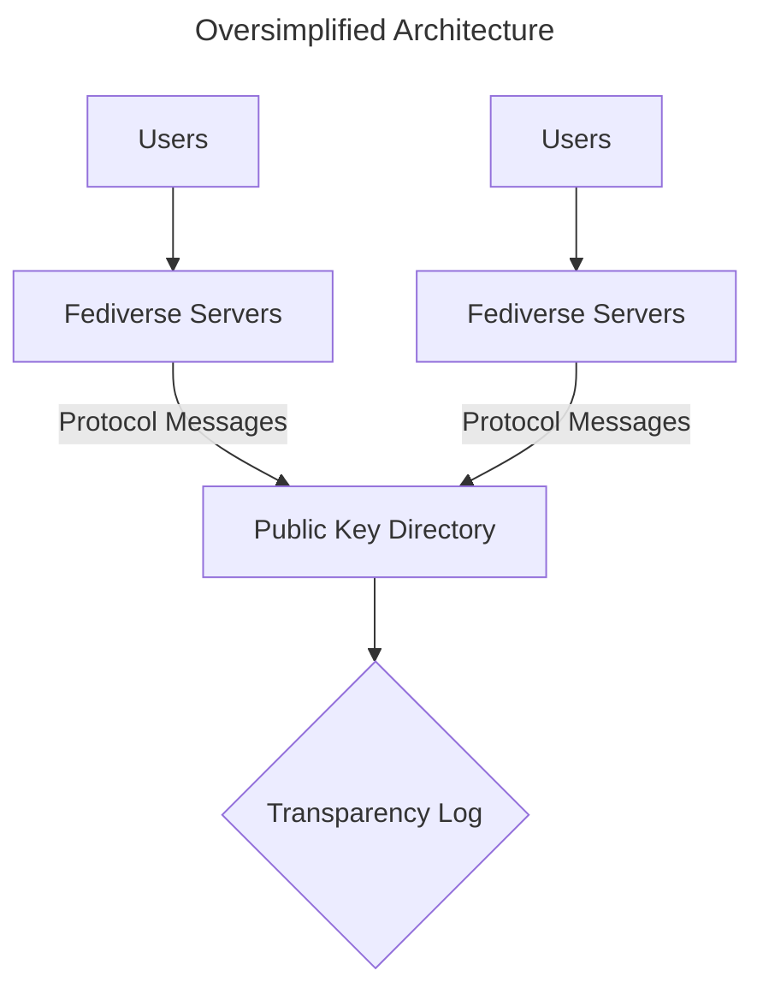
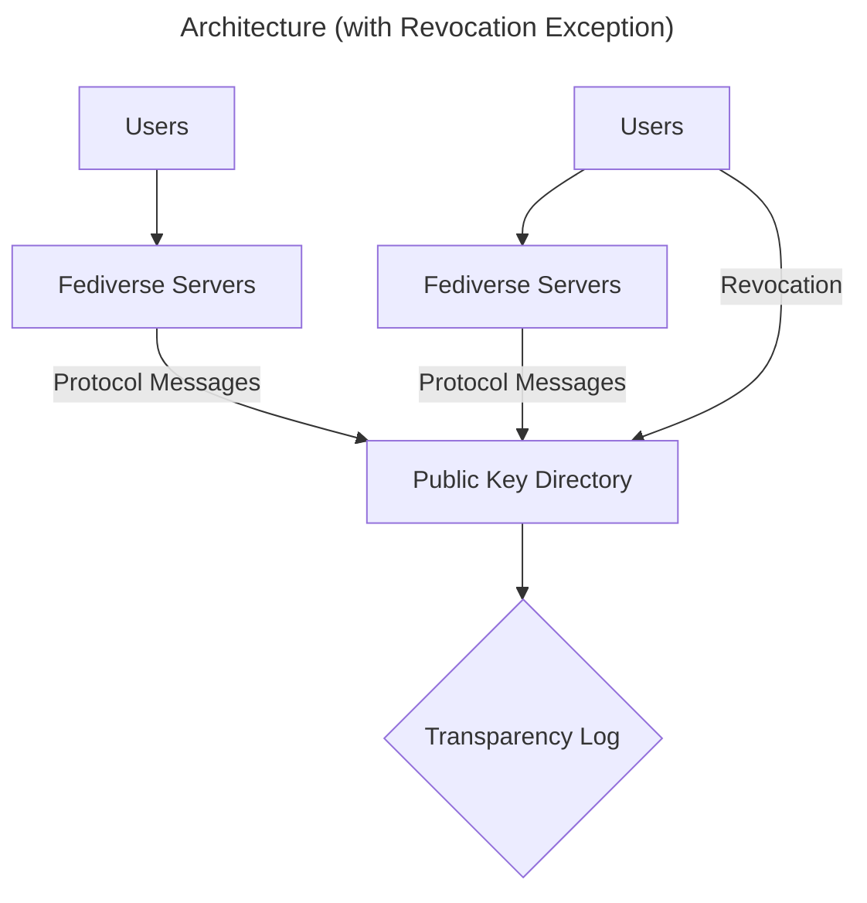

# Architecture

The picture in general looks like this:

Fediverse Servers will use [HTTP Signatures](https://swicg.github.io/activitypub-http-signature/)
to send Protocol Messages to one or more Public Key Directory (PKD). Each directory will use
a Transparency Log to store checksums of these messages.

There will be exceptions to this general rule.

For example: To prevent Fediverse servers from censoring revocations, users will be able
to publish a revocation for a compromised secret key directly to a Public Key Directory. However, this
should not be the typical user experience.

## Fediverse Servers

This is your typical Fediverse server instance software (Mastodon, etc.), provided they have been updated
to support Public Key Directories.

## Public Key Directory

The Public Key Directory (PKD) is what this repository is focused on specifying.  It will support
[ActivityPub](https://www.w3.org/TR/activitypub/) messages for reading and writing, as well as a
simple JSON REST API for querying public keys for individual users (read only).

## Transparency Log

The Transparency Log is an append-only data structure that stores information in a [`tlog-tiles`](https://github.com/C2SP/C2SP/blob/main/tlog-tiles.md)
compatible format. It stores the following information:

* SHA-256 hash of some data
* Ed25519 signature of the SHA256 hash
* SHA-256 hash of the Ed25519 public key

Each leaf should, therefore, only require 128 bytes of real storage.

## Roles

### User

A user wants to use End-to-End Encryption for ActivityPub direct messages to communicate with other users or share [Auxiliary Data](/Specification.md#auxiliary-data) with them via the PKD.
The user already has an account at a Fediverse Server or creates one to use the PKD.

### Fediverse Operator (Fedi Operator)

The Fediverse Operator manages one or more Fediverse Server instances.
This operator is responsible for managing the users of their instances and for choosing a PKD instance for their Fediverse Servers.

### PKD Operator

The PKD Operator manages the daily operations of their PKD.
The PKD Operator adds the trusted Fediverse Servers to the PKD.

## Questions and Answers

### Why are Public Key Directories separate from the Fediverse Servers?

As sketched in the diagrams above, each Public Key Directory will have a one-to-many relationship with Fediverse 
Servers.

The goal of this architecture decision is to achieve something close to what Taylor Hornby calls
[Userbase Consistency Verification](https://defuse.ca/triangle-of-secure-code-delivery.htm#:~:text=are%20successfully%20attacked.-,Userbase%20Consistency%20Verification,-%3A).
when describing the requirements for a secure code delivery system.

We do not expect to perfectly achieve this goal, however. The Fediverse is inherently fragmented.

For example, users on an LGBTQIA+-friendly instance will generally not want to host the identity keys for Truth Social.

You are **NOT** required to adhere to this separation. We do recommend it, however.

A large part of the [threat model](Specification.md#threat-model) is focused on protecting users from curious or 
malicious administrators. If the same entity controls the Fediverse Server **AND** the Public Key Directory, they are
able to perform more sophisticated attacks than if there is a separation of responsibility. 
