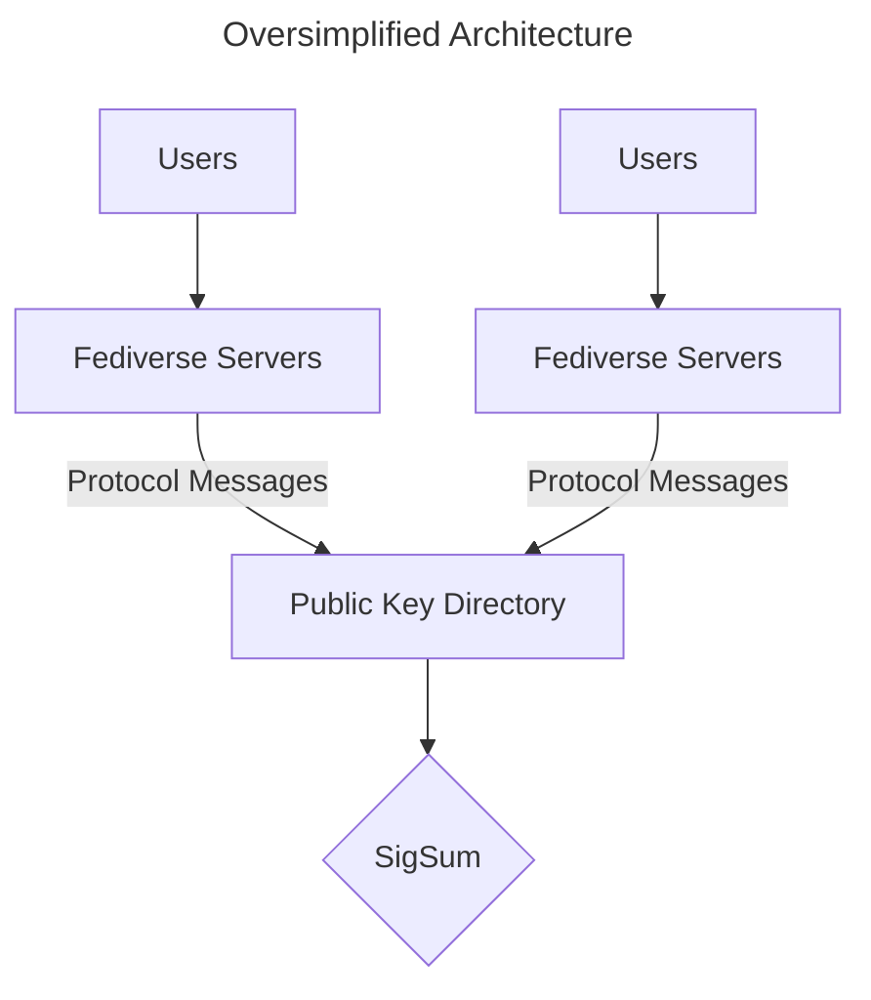
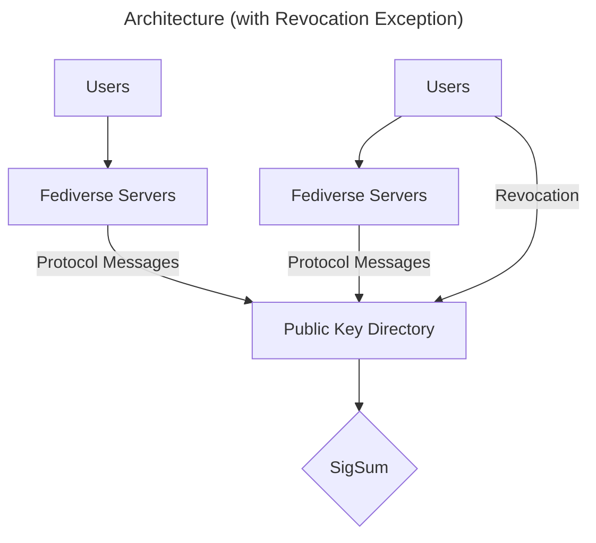

# Architecture

The picture in general looks like this:

Fediverse Servers will use [HTTP Signatures](https://swicg.github.io/activitypub-http-signature/)
to send Protocol Messages to one or more Public Key Directory (PKD). Each directory will use
[SigSum](https://sigsum.org) to store checksums of these messages.

There will be exceptions to this general rule.

For example: To prevent Fediverse servers from censoring revocations, users will be able
to publish a revocation for a compromised secret key directly to a Public Key Directory. However, this
should not be the typical user experience.

## Fediverse Servers

This is your typical Fediverse server instance software (Mastodon, etc.), provided they have been updated
to support Public Key Directories.

## Public Key Directory

The Public Key Directory (PKD) is what this repository is focused on specifying.  It will support 
[ActivityPub](https://www.w3.org/TR/activitypub/) messages for reading and writing, as well as a 
simple JSON REST API for querying public keys for individual users (read only).

## SigSum

The [SigSum](https://www.sigsum.org/) component is an append-only data structure that stores signatures
in a Merkle tree. It doesn't natively support arbitrary data storage, so we only use it for verifying
the messages and records stored in the PKD.

# Roles

# User

A user wants to use End-to-End Encryption for ActivityPub direct messages to communicate with other users or share [Auxiliary Data](/Specification.md#auxiliary-data) with them via the PKD.
The user already has an account at a Fediverse Server or creates one to use the PKD.

# Fediverse Operator (Fedi Operator)

The Fediverse Operator manages one or more Fediverse Server instances.
This operator is responsible for managing the users of their instances and for choosing a PKD instance for their Fediverse Servers.

# PKD Operator

The PKD Operator manages the daily operations of their PKD and the SigSum Server.
The PKD Operator adds the trusted Fediverse Servers to the PKD.
