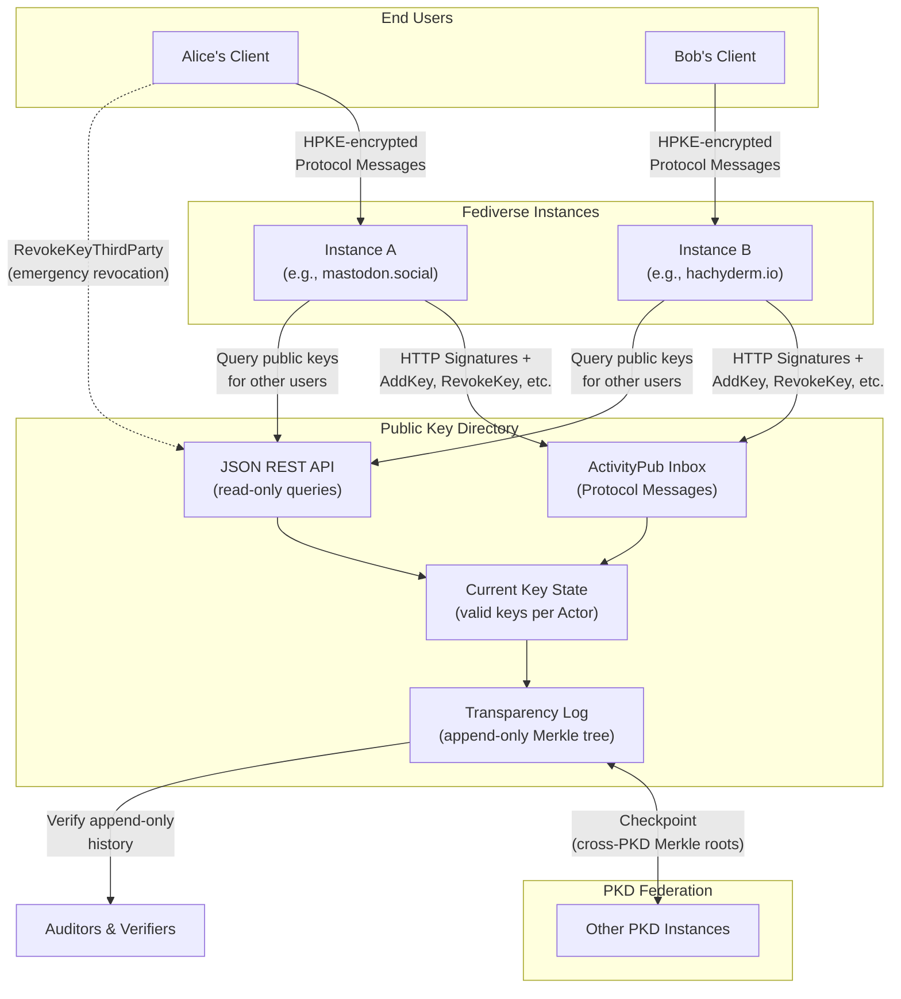

# Public Key Directory Server Specification

This repository contains the specification for a **Public Key Directory** for the Fediverse.

> [!CAUTION]
> This is still a work in progress.
> 
> There may be bugs. Some things may be under-specified, or there could be subtle contradictions.
> [Please tell us](https://github.com/fedi-e2ee/public-key-directory-specification/issues/new) if we made a mistake.

## What Is This All About?

> [!NOTE]
> If you're more technical, [feel free to skip this section](#our-proposal).

This project is an infrastructure component to improve the privacy of the Fediverse. Its intended audience is software
developers, system administrators, security researchers, academics, cryptographers, and technology experts.

If you're not already familiar with the Fediverse (e.g., Mastodon), [The Verge](https://www.theverge.com/24063290/fediverse-explained-activitypub-social-media-open-protocol) 
([archived](https://archive.is/TuNUu)) tried to explain it in 2024.

Currently, Direct Messages (DMs) on the Fediverse are like postcards: Server admins and malicious hackers can read them,
if they want to. Law enforcement can also compel server admins to disclose them if they want to prosecute you, and there
is little recourse for them except to comply. (Unlike large tech companies, most instance admins do not have a large
legal defense fund to fight the government in court.)

The architects of the Fediverse are investigating a technique called [end-to-end encryption](https://github.com/swicg/activitypub-e2ee)
to alleviate this privacy risk. This is like upgrading from postcards to sealed envelopes that only the recipient can
open. This envelope upgrade requires careful use of math that involves something called a "public key". You can think of
it as a special lock that only the intended party can open.

### Where does this project come in?

The hardest part of designing end-to-end encryption for the Fediverse is actually a **Key management** problem, which
can be summed up as one question:

> How do you know which public key belongs to a stranger you want to chat privately with?

How ever you decide to initially answer that question, the obvious follow-up question is:

> How do you know that you weren't deceived?

And if you repeat this exercise, you will eventually reinvent a trust model for a public key infrastructure.

### Why This Problem Is Harder Than It Looks

There are some obvious questions that arise when first faced with this problem, depending on your technical background.

#### Why not just a simple directory?

A simple directory is quick and easy: Just look up a username and get their public key. ActivityPub already offers such
a mechanism with [webfinger](https://webfinger.net/). Why not just rely on that?

The problem is: You have to **completely trust** whoever runs that directory. If a simple directory operator is 
compromised, or decides to be malicious, they can silently hand you the wrong key for someone you want to message, and
you'd have no way to detect it. The key you think belongs to Alice might actually belong to an attacker.

#### Why not just use Certificates and Certificate Authorities?

This creates a power structure where a few trusted entities (Authorities) have the capability to impersonate anyone in
the ecosystem. This gives hackers and hostile governments easy targets to prioritize, and is fundamentally incompatible
with the goals and culture of the Fediverse.

#### Why not use an existing solution?

The technical details matter a lot. Read [the thread model](Specification.md#threat-model) to understand more about what
features and security properties we're trying to provide, which isn't compatible with existing designs.

(This README only gets more technical from this point on.)

## Our Proposal

Our solution is to require all relevant actions (public key enrollment and revocation) be published immediately onto an 
append-only data structure (i.e., a [Merkle tree](https://en.wikipedia.org/wiki/Merkle_tree)). In the cryptographic
literature, this is called "Key Transparency".

The Public Key Directory vends a user's public keys (which originate from the user's device) that can be used with 
digital signature algorithms, and includes a machine-verifiable proof of when each public key was enrolled.

This machine-verifiable proof is useful for establishing a baseline, minimal level of trust that a given public key is
correct for the party you wish to talk to. That is to say: **It keeps the directory honest.**

Additional manual key verification mechanisms (key fingerprints, safety numbers, etc.) are out-of-scope but totally 
permitted for technical users in higher-level protocols. Really, we're trying to do better than Trust on First Use 
(TOFU), so [Johnny can finally encrypt](https://people.eecs.berkeley.edu/~tygar/papers/Why_Johnny_Cant_Encrypt/OReilly.pdf). 

Other applications can build atop our Public Key Directory design to build advanced use cases (i.e., authenticated key 
exchanges for end-to-end encryption).

It's worth keeping in mind that the Public Key Directory isn't *just* the Merkle Tree, it's an API built on top of a
Merkle Tree. To that end, you can query the API to retrieve every currently-trusted public key for a user, rather than
having to manually parse this information out of the data stored in the underlying data structure.

### How Does This Help Non-Technical Users?

The Public Key Directory is a building block for developers. Our immediate audience for this specific component is 
necessarily somewhat technical.

However, the projects that build *atop* this building block should take pains to minimize the friction for non-technical
users. (That includes the other projects we will be opening in this GitHub organization!)

### What kind of keys are vended by the Public Key Directory?

Public keys meant for verifying digital signatures, not encryption keys.

To integrate the Public Key Directory with a broader E2EE project, you can use the signature verification keys to verify
a signed [key package (in MLS parlance)](https://www.rfc-editor.org/rfc/rfc9420.html#name-key-packages). This provides
assurance that the "key package" your software is using to start a private chat is actually owned by your friend.

### Does the Public Key Directory publish anything except those public keys?

**Yes!** The Public Key Directory additionally publishes [Auxiliary Data](Specification.md#auxiliary-data), which allows
developers a convenient way to build key transparency into their own systems by building atop ours.

### How the Pieces Fit Together

* **Users** generate keys locally and send encrypted [Protocol Messages](Specification.md#protocol-messages) through
  their Fediverse instance
* **Instances** add HTTP Message Signatures ([RFC 9421](https://www.rfc-editor.org/rfc/rfc9421.html)) and relay messages
  to the Public Key Directory (PKD)
* **PKD** validates messages, updates key state, and commits everything to the transparency log
* **Disaster recovery** that can [pass the Mud Puddle test](https://blog.cryptographyengineering.com/2012/04/05/icloud-who-holds-key/)
  is baked into our design:
  * Third-party revocation allows users to revoke compromised keys directly, bypassing a potentially malicious
    instance
  * Recovery is enabled through [BurnDown](Specification.md#burndown); users can elect to become 
    [Fireproof](Specification.md#fireproof) to become immune to BurnDown
* **Federation** enables multiple PKDs to cross-verify via Checkpoint messages
* **Auditors** can independently verify the append-only log hasn't been tampered with

## Our Guiding Principles

All design decisions for this proposal have been influenced by the following guiding principles.

1. Build for people, and
2. Security over legacy

### Build for People

The main goal of this project is to enable more people to securely communicate with each others.
From this it follows that we

* don't require any expert knowledge from the users of this system.
* minimize the number of steps a user has to take to use this system securely.
* value the privacy of the users, by only storing the minimal amount of information necessary and make it possible to delete data when the user demands it.
* clearly communicate errors and incidents to the users and by doing so give them a proper understanding of their security state.

As a side note, we don't consider companies as people.

### Security Over Legacy

We want to build a system, which solves key management for people, nothing less and nothing more.
There are many ways to solves this problem and many existing solutions which could become part of our solution.
But we want to take the opportunity to focus on security and verifiability.
This means if we have the choice we will not take an existing solution, when this solution leads to an unwarranted increase in complexity or a security compromise. Even if this solution is an established standard and used by everyone else.

## Documents In Scope

* [Architecture](Architecture.md)
  \- This document succinctly describes how the Public Key Directory fits into the Fediverse.
* **[Specification](Specification.md)**
  \- This document contains the specification text in its entirety.
  1. [Introduction](Specification.md#introduction)
  2. [Concepts](Specification.md#concepts)
  3. [Threat Model](Specification.md#threat-model)
  4. [Protocol Messages](Specification.md#protocol-messages)
  5. [The Federated Public Key Directory](Specification.md#the-federated-public-key-directory)
  6. [Cryptography Protocols](Specification.md#cryptography-protocols)
  7. [Security Considerations](Specification.md#security-considerations)
* [Test Vectors](Test-Vectors.md)
  \- This document will contain test vectors for the protocols used in the Public Key Directory.

## Reference Implementation

The [**Public Key Directory Reference Implementation**](https://github.com/fedi-e2ee/pkd-server-php) is now available.

## Historical Development Blogs

This section includes some highlights that may be worth considering to understand the technical underpinnings of our
design. Reading them is not mandatory, but should provide insight into how we approached these problems.

1. [Towards Federated Key Transparency](https://soatok.blog/2024/06/06/towards-federated-key-transparency) (June 2024)
    * This blog post kicked this project off. It explains the motivation and how it fits into the goal of delivering
      "end-to-end encryption for the Fediverse".
2. [Key Transparency and the Right to be Forgotten](https://soatok.blog/2024/11/21/key-transparency-and-the-right-to-be-forgotten/)
   (November 2024)
    * This blog post describes how we square the auditable, append-only nature of Merkle Trees with a desire to not make
      complying with a nation's *Right To Be Forgotten* technically impossible.

## Extensions for Auxiliary Data

See the [Extensions](https://github.com/fedi-e2ee/fedi-pkd-extensions) repository.
