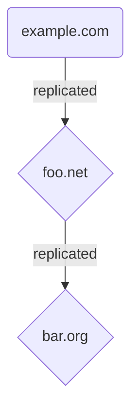

# Public Key Directory Specification

This document defines the Fediverse End-to-End Encryption Public Key Directory (FediE2EE-PKD), which consists of 
ActivityPub-enabled directory server software, a protocol for communicating with the directory server, and integration
with a transparent, append-only data structure (e.g., based on Merkle trees).

* Current version: v0.1.0
* Authors: [Soatok Dreamseeker](https://github.com/soatok)

## Introduction

### Motivation

One of the challenges for building any cryptographic protocol in federated or peer-to-peer protocols is establishing
some sort of identity for the other parties. This is as true of systems for signing Git commits as it is for 
end-to-end encryption.

This challenge is not unique to federated systems and is usually solved by some sort of Public Key Infrastructure (PKI).

#### Public Key Infrastructures

The classic SSH approach to addressing this problem is "Trust On First Use". Simple yet effective in many threat models.
The obvious downside of "Trust On First Use" is that it creates a race condition that an attacker can exploit to get
their substitute public key trusted first.

The earliest designs for SSL/TLS required the use of Certificate Authorities, whose public keys would be provided by
the Operating System as a root of trust. Each CA's public key would then be used to sign a cadre of intermediate
certificates, which could in turn be used to sign individual servers' public keys (in the form of Certificates).
The downside is that if any of these Certificate Authorities were compromised (as [has happened with nation states](https://www.wired.com/2012/05/flame/)),
the downstream security consequences are immense.

The OpenPGP solution to this problem is called Web of Trust, which involves a long chain of folks signing each other's
public keys. The reasoning goes, if your friend's public key was signed by Linus Torvalds, they're probably a legitimate
Linux kernel contributor. However, if you're trying to establish the identity of someone without strong pre-existing
social ties, this is not a very helpful system.

This historical context is an oversimplification, of course. It's possible to use SSH with certificate authorities, for
example.

In recent years, the cryptography community has moved towards transparency ledgers for important cryptographic designs.
TLS certificates are now required to be published in a Certificate Transparency ledger. WhatsApp now uses a mechanism
called [Key Transparency](https://engineering.fb.com/2023/04/13/security/whatsapp-key-transparency/) to secure their
End-to-End Encryption.

To that end, we hope to build a PKI for the Fediverse primarily focused on transparency logs. It's important that our
solution does not rely on trusted third parties (i.e., Certificate Authorities) for the PKI to be secure.

#### Use Case

The primary use case is to support End-to-End Encryption for ActivityPub direct messages between users.

However, we also want to support developers seeking supplemental use cases (e.g., exchanging [age](https://github.com/FiloSottile/age)
public keys for encrypted file sharing).

### This Document

We propose a specification for a Public Key Directory server, which acts as both a storage layer and shim for a Merkle
Tree-based append-only data ledger.

We specify a protocol for communicating with the Public Key Directory server, which will mostly be performed in the
context of a Fediverse server.

We further specify a public JSON REST API for reading public keys for specific Fediverse users, that the Public Key
Directory software will implement.

Finally, we discuss some security considerations for building atop our Public Key Directory server.

### Out Of Scope

Client software behavior is not in scope for this document.

Fediverse server behavior is largely out of scope for this document, provided it correctly implements the protocol to
communicate with the Public Key Directory.

Backwards compatibility with existing systems (i.e., the PGP ecosystem) is a non-goal.

Legal compliance frameworks (e.g., GDPR) are largely out of scope. We make some design considerations that aim to 
alleviate specific technical issues that would otherwise *introduce* compliance obstacles, but go no further.
We are not lawyers; this document does not contain legal advice.

### Notation and Conventions

The key words "**MUST**", "**MUST NOT**", "**REQUIRED**", "**SHALL**", "**SHALL NOT**", "**SHOULD**", "**SHOULD NOT**",
"**RECOMMENDED**", "**MAY**", and "**OPTIONAL**" in this document are to be interpreted as described in 
[RFC 2119](https://datatracker.ietf.org/doc/html/rfc2119).

## Concepts

### Identity Binding

This project will map ActivityPub Actor IDs to a set of one or more Public Keys. Optionally, some number of
Auxiliary Data records may also be supported, in order for other protocols to build atop the Public Key Directory (PKD).

The task of resolving aliases to Actor IDs is left to the client software.

### Message Blocks

This project is built atop an append-only transparency log. Each Protocol Message will be processed and appended to the
ledger. The Public Key Directory software will maintain a current state of which public keys and auxiliary data are
currently valid for a given Actor.

Any other machine **MUST** be able to reproduce the same state as the Public Key Directory by replaying the entire 
message history from the first block to the current one. Any deviation from this behavior is considered an attempted
attack on the system.

This means that history is immutable, with one exception: [the ability for the protocol to forget users](#message-attribute-shreddability).
This is achieved by committing encrypted fields to the Merkle tree, and storing an encryption key on the Public Key
Directory server until the encryption key's erasure is legally requested.

Each Protocol Message **MUST** be unique. Public Key Directory servers **MUST** reject any replayed Protocol Message,
even if it's otherwise valid.

Implementations **SHOULD** provide a distinct error message for when a unique message has already been accepted and
processed by the system in a very recent period of time. This **MUST** be distinct from an error condition. 

### Public Key Encoding

Each public key will be encoded as an unpadded [base64url](https://datatracker.ietf.org/doc/html/rfc4648#section-5) 
string prefixed by the cryptography protocol name followed by a colon.

For example: `ed25519:Tm2XBvb0mAb4ldVubCzvz0HMTczR8VGF44sv478VFLM`

### Merkle Root Encoding

Each Merkle Root will be encoded as an unpadded [base64url](https://datatracker.ietf.org/doc/html/rfc4648#section-5) 
string, prefixed with a distinct prefix for the current protocol version followed by a colon (currently, `pkd-mr-v1:`).

For example: `pkd-mr-v1:7TwKAbkiKCCQuCpDBV2GbkkkIDfMg2AmG7TMHqXBDJU`

### Protocol Signatures

Every [Protocol Message](#protocol-messages) will contain a digital signature. Unless otherwise specified, these
signatures will always be calculated the same way:

Each digital signature will be calculated over the following information (in this order):

1. The value of the top-level `!pkd-context` attribute.
2. The value of the top-level `action` attribute.
3. The JSON serialization of the top-level `message` attribute.
   Object keys **MUST** be sorted in ASCII byte order, and there **MUST** be no duplicate keys.
4. The value of the top-level `recent-merkle-root` attribute.

To ensure domain separation, we will use [PASETO's PAE()](https://github.com/paseto-standard/paseto-spec/blob/master/docs/01-Protocol-Versions/Common.md#pae-definition)
function, with a tweak: We will insert the top-level key (`!pkd-context`, `action`, `message`, `recent-merkle-root`)
before each piece.

For example, a Python function might look like this:

```python
def signPayload(secret_key, payload):
    payloadToSign = preAuthEncode([
        b'!pkd-context',
        payload['!pkd-context'],
        b'action',
        payload['action'],
        b'message',
        json_stringify(sort_by_key(payload['message'])),
        b'recent-merkle-root',
        payload['recent-merkle-root'],
    ])
    return base64url(crypto_sign(secret_key, payloadToSign))
```

The `!pkd-context` strings are intended to provide domain separation. 

Raw hashes and signatures without any domain separation in the direct scope of this specification are considered a 
security vulnerability. 

Raw hashes or signatures in the Merkle Tree, or in protocols built atop the Public Key Directory, are not considered
security vulnerabilities in our specification.

### Key Identifiers

Every time an `AddKey` message is accepted by the Public Key Directory, the PKD will generate a 256-bit random unique
`key-id` for that public key. This value is not secret or sensitive in any way, and is only used to point to an existing
public key to reduce the amount of rejected signatures software must publish.

Every message except revocations and the first `AddKey` for an Actor **SHOULD** include a `key-id` value.
Each `key-id` is encoded as an unpadded [base64url](https://datatracker.ietf.org/doc/html/rfc4648#section-5).

The `key-id` attribute **MUST NOT** be an encoded representation of the public key. The motivation for this restriction
is to prevent accidental misuse (i.e., someone just decoding the public key from a message and trusting it blindly).

The `key-id` is not covered in the protocol messages being signed. Instead, it is a hint to the signature validation
software which public key to select when there is more than one option. Their values are totally arbitrary and, aside
from uniqueness, serve no other purpose.

### Revocation Tokens

A revocation token is a compact token that a user can issue at any time to revoke an existing public key. If they issue
a revocation against their only public key, the Public Key Directory will treat it as a `BurnDown`.

Revocation tokens are [base64url](https://datatracker.ietf.org/doc/html/rfc4648#section-5)-encoded strings in the
following format:

```
tmp := version || REVOCATION_CONSTANT || public_key 
revocation_token := base64url_encode(tmp || Sign(secret_key, tmp))
```

Where:
 * `version` is the version of the protocol being used (currently, `FediPKD1`).
 * `REVOCATION_CONSTANT` is a domain-separated constant for revoking an existing key. Its current value is
   the `0xFE` byte repeated 32 times followed by `revoke-public-key`.
 * `Sign(sk, m)` performs the digital signature algorithm corresponding to the current protocol version.
   (Currently, Ed25519.)

These values **MAY** be encrypted and stored in case of emergency. There is no temporal or random component to the 
message format, so they can be issued at any time.

If you stumble upon another user's secret key, generating a revocation token should be straightforward.

Security researchers are encouraged to push revocation tokens whenever another person's secret key is compromised, and
said security researcher has deemed it necessary to do so to minimize harm.

### Auxiliary Data

The Public Key Directory will advertise a list of Auxiliary Extensions, which can be developed at a later time, that 
define the types and formats of Auxiliary Data that will be accepted by a particular PKD server.

For example, a PKD Server may include `age-v1` in its list of Auxiliary Extensions, which in turn allows users to submit
`AddAuxData` and `RevokeAuxData` messages that include an [age v1](https://github.com/FiloSottile/age) public key.

The intent of Auxiliary Data is to allow developers to build their PKD extensions in order to integrate  with their own
systems without interfering with the normal operation of the PKD server. This also allows us to be stricter about our
cryptography primitive choices.

For example, if someone wanted to build a protocol that used `ssh-rsa` public keys, they can without us needing to
natively support RSA at all. They'll just need to shove them into Auxiliary Data.

#### Auxiliary Data Identifiers

Every Auxiliary Data will have a deterministic unique identifier based on the extension and the contents of the data.

It can be calculated as follows, using the `preAuthEncode` function from PASETO (PAE):

```python
def getAuxDataId(aux_type, data):
    return hmac_sha256(
        b'FediPKD1-Auxiliary-Data-IDKeyGen', # this key is a constant for v1 of this protocol specification
        PAE([
            b'aux_type',
            aux_type,
            b'data',
            data
        ])
    )
```

#### Requirements for Auxiliary Data Extensions

Being very strict about the format of the data accepted by a given extension is highly **RECOMMENDED**.

See [the relevant threat model entry](#attacker-submits-contraband-as-auxiliary-data)_

### Message Attribute Shreddability

While the security benefits of a public immutable append-only ledger are enormous, some jurisdictions may rule that an
Actor ID is in scope of some legislation; e.g., the European Union's Right to be Forgotten (part of the GDPR). The
introduction of an append-only immutable data ledger is not logically compatible with these laws (which stipulate that
a person can request their history be deleted on demand).

Presently, there is no clear legal guidance on how to best navigate this issue. There are untested legal theories, but
none backed up by case law. Additionally, using a totally anonymous look-up-table introduces the risk of rewritten 
on-the-fly by the Public Key Directory administrators. This is an unacceptable risk.

As a best-effort, good faith design decision, we will introduce the technical capability to "shred" Actor IDs and other
message attributes (which may contain usernames, and usernames are definitely personal data in scope of the *Right
to be Forgotten*).

Consequently, we will add a layer of indirection to the underlying Message storage and Sigsum integration, for handling
sensitive attributes (e.g., Actor ID):

1. Every Message will have a unique 256-bit random key per sensitive attribute. These can be generated client-side or provided by the Public Key
   Directory, so long as the keys never repeat. The Public Key Directory will include a key-generation API endpoint for
   generating 256-bit keys for this purpose.
2. Each attribute will be encrypted with the corresponding key from (1), using a committing authenticated encryption mode.
   The encryption steps are described in [a later section](#message-attribute-encryption-algorithm).

During insert, of an attribute clients will provide both an encrypted representation of the attributes value in `message.<attribute>`, and disclose
the accompanying key in the `symmetric-keys.<attribute>` (outside of `message.`, and not covered by the signature).

When requesting data from the ledger, the Message will be returned as-is (i.e., ciphertext), along with the decrypted
Message (provided the key has not been shredded yet).

To ensure the link between the encrypted message and plaintext message is provable, clients will also generate and 
publish a commitment of the plaintext. This prevents a server from serving the wrong plaintext alongside a given
ciphertext and fooling clients into believing it.

The keys are not included in the Sigsum data, but stored alongside the record in a separate editable database.

The decrypted message is also not included in the Sigsum data.

To satisfy a "right to be forgotten" request, the key for the relevant blocks will be erased. The ciphertext will 
persist forever, but without the correct key, the contents will be indistinguishable from randomness. Thus, the system
will irrevocably forget the Actor ID or other message attribute for those records.

It's important to note that this is not a security feature, it's meant to eliminate a compliance obstacle.

Crypto-shredding and message attribute encryption are intended to allow the system to forget how to read a specific 
record while still maintaining an immutable history.

> Note: We considered using a zero-knowledge proof for this purpose, but couldn't justify the additional protocol
> complexity. For the curious, one of the authors of this specification 
> [blogged about this topic in depth](https://soatok.blog/2024/11/21/key-transparency-and-the-right-to-be-forgotten/).

It does not guarantee that other clients and servers did not persist the key necessary to comprehend the contents of the
deleted records, since it's generated client-side, and we cannot control the behavior of client software. However, it 
does mean that the liability is with those other clients and servers rather than our ledger, and that is sufficient for
de-risking our use case.

### Timestamps

All timestamps must be a string representing a 64-bit UNIX Timestamp, encoded in base-10. For example, `"1724364843"`.

We choose strings here to allow implementations to parse it as a BigInt (or equivalent) in their respective programming
language without the JSON parser automatically losing precision for large values (e.g., larger than 2^{53} in 
JavaScript).

Implementations **MUST NOT** truncate UNIX timestamps to 32 bits.

## Threat Model

In order to understand the security goals of this system, it is important to assess our assumptions, assets, actors, and
the risks; both the risks that this system is designed to mitigate and the ones it cannot.

### Assumptions

1.  The operating system's random number generator is secure.
2.  The hardware that our software is running on has not been tampered with to render its operation insecure.
3.  The elliptic curve discrete logarithm problem is computationally hard.
4.  The SHA-2 family of hash functions (SHA-256, SHA-384, SHA-512) are secure.
5.  HMAC, used with a SHA-2 family hash function, offers PRF security congruent to the size of the hash function.
6.  AES is a secure block cipher (which can be modeled as a secure permutation) that offers a security level congruent
    to the length of its key.
7.  EdDSA, as defined over the Edwards25519 curve, provides strong existential forgery under chosen message attack
    (SUF-CMA) security, at a security level in excess of 120 bits.
8.  Argon2id is a secure, memory-hard password-based key derivation function.
9.  HKDF with HMAC and a SHA-2 family hash function, with a static salt and variable info parameters, provides KDF
    security (which is a stronger notion than PRF security that makes no assumptions about the distribution of IKM bits).
10. [HPKE (RFC 9180)](https://datatracker.ietf.org/doc/rfc9180/)--when instantiated as 
    [Curve25519_SHA256_ChachaPoly](#hpke-cipher-suites)--provides IND-CCA2 security against adversaries not in 
    possession of the X25519 secret key.
11. AES in Counter Mode can be used to encrypt up to 2^{36} successive bytes under the same (key, initial counter),
    and the resulting ciphertext will be indistinguishable an encryption of NUL (`0x00`) bytes.
12. Merkle trees based on a secure hash function (assumption 4) provide a secure verifiable data structure.

### Assets

1. JSON REST API, available over HTTPS.
2. ActivityPub integration.
3. Sigsum integration.
4. Shreddable symmetric-key storage.
5. Local relational database.
6. Mapping of Actor IDs to associated data.
   * Public Keys
   * Auxiliary Data
7. ActivityPub instance software. (**Out of scope.**)
8. Client-side software. (**Out of scope.**)

### Actors

In this section, Actors does not refer specifically to ActivityPub Actors. Rather, they are placeholders for 
participants in our system. This includes legitimate users and various types of attackers. These actors' names are
defined in alphabetical order within each classification.

1. **Honest users** that wish to communicate. We will use four examples when discussing threats. 
   * **Alice** is a Fediverse user and instance administrator.
   * **Bob** is a Fediverse user hosted by Alice's instance.
   * **Carol** is a self-hosted Fediverse user who runs her own instance.
   * **Dave** is a Fediverse user on Richard's instance. (Richard is defined below.)
2. **Attackers** are motivated individuals that seek to damage or impair the normal operation of the system.
   * **Grace** is a government representative for a hostile nation-state that does not want citizens to have privacy.
   * **Harry** is a cyber-stalker that seeks to harass one or more of the honest users.
   * **Karen** is a Troy (defined below) that pretends to be a Eugene and goes directly to the legal system to cause
     operator distress.
   * **Mallory** wishes to replace one of the honest users' public keys with her own.
   * **Richard** is an instance administrator that wishes to eavesdrop on his users' private communications.
   * **Troy** is an Internet troll that wants to wreak havoc for the lulz.
   * **Yvonne** has privileged access to a Public Key Directory server.
3. **Other Participants** do not fall into either of the previous attackers.
   * **Eugene** used to be an honest user, but now seeks to have the system forget he ever existed. When Eugene is
     secretly actually a Troy that escalates to the legal system early, we consider them Karen instead. 

### Risks

This section seeks to outline specific risks and whether they are prevented, mitigated, addressable, or open.

| Risk                                                                                                                                                                                                               | Status                  |
|--------------------------------------------------------------------------------------------------------------------------------------------------------------------------------------------------------------------|-------------------------|
| [Attackers seek to change history.](#attackers-seek-to-change-history)                                                                                                                                             | **Prevented by design** |                                                                        
| [Attackers seek to selectively censor historical records.](#attackers-seek-to-selectively-censor-historical-records)                                                                                               | Addressable             |
| [Attackers seek to replace public key mappings without altering the ledger.](#attackers-seek-to-replace-public-key-mappings-without-altering-the-ledger)                                                           | **Prevented by design** |
| [Attackers seek to leverage plaintext commitment to recover encrypted records whose keys were wiped.](#attackers-seek-to-leverage-plaintext-commitment-to-recover-encrypted-records-whose-keys-were-wiped)         | **Prevented by design** |
| [Instance administrator enrolls a public key on behalf of an un-enrolled user.](#instance-administrator-enrolls-a-public-key-on-behalf-of-an-un-enrolled-user)                                                     | _Open_                  |
| [Instance administrator attempts to enroll a new public key for a previously enrolled user.](#instance-administrator-attempts-to-enroll-a-new-public-key-for-a-previously-enrolled-user)                           | **Prevented by design** |
| [Instance administrator attempts to reset the public keys for a previously enrolled user.](#instance-administrator-attempts-to-reset-the-public-keys-for-a-previously-enrolled-user)                               | Addressable             |
| [Race condition between successful BurnDown and subsequent AddKey.](#race-condition-between-successful-burndown-and-subsequent-addkey)                                                                             | _Open_                  |
| [Hostile nation state demands their public key be added to an existing actor under a gag order.](#hostile-nation-state-demands-their-public-key-be-added-to-an-existing-actor-under-a-gag-order)                   | Mitigated               |
| [Hostile nation state seeks to abuse Right To Be Forgotten mechanisms to cover up an unlawful intrusion.](#hostile-nation-state-seeks-to-abuse-right-to-be-forgotten-mechanisms-to-cover-up-an-unlawful-intrusion) | _Open_ / Addressable    |
| [Instance administrator loses all their signing keys.](#instance-administrator-loses-all-their-signing-keys)                                                                                                       | Mitigated               |
| [Attacker sends spoofed messages on behalf of another server.](#attacker-sends-spoofed-messages-on-behalf-of-another-server)                                                                                       | **Prevented by design** |
| [Attacker sends spoofed messages from a compromised Fediverse server.](#attacker-sends-spoofed-messages-from-a-compromised-fediverse-server)                                                                       | Addressable             |
| [Cosmic ray causes a bit-flip on stored data or the result of a computation.](#cosmic-ray-causes-a-bit-flip-on-stored-data-or-the-result-of-a-computation)                                                         | _Open_                  |
| [Malicious instance administrator attempts to censor Fireproof messages to retain control.](#malicious-instance-administrator-attempts-to-censor-fireproof-messages-to-retain-control)                             | Mitigated               |
| [Malicious instance administrator also controls the Public Key Directory.](#malicious-instance-administrator-also-controls-the-public-key-directory)                                                               | _Open_                  |
| [Attacker uses a decoy Public Key Directory that publishes a dishonest history.](#attacker-uses-a-decoy-public-key-directory-that-publishes-a-dishonest-history)                                                   | _Open_                  |
| [Attacker submits contraband as auxiliary data.](#attacker-submits-contraband-as-auxiliary-data)                                                                                                                   | Addressable             |

Each status is defined as follows:

* **Prevented by design**: This risk is prevented (provided our assumptions above hold true) by our specification.
* **Mitigated**: This risk is not totally prevented, but its useful consequences for attackers are.
* **Addressable**: This risk can be mitigated, but requires another precondition to be true. If it's not true, then this
  risk is actually Open. The truth value of this precondition may vary from user to user.
* **Open**: This is a risk that we have not prevented.

#### Attackers seek to change history.

**Status**: Prevented by design.

Mallory seeks to replace one of the honest users' public keys with one she controls so that she can impersonate them
when talking to their friends.

She is thwarted from updating old records by the append-only nature of Merkle trees.

#### Attackers seek to selectively censor historical records.

**Status**: Addressable (can be mitigated; requires diligence).

There are two variants of this risk.

1. Eugene legitimately wishes to have his username and historical public keys wiped from public memory, and asserts his
   rights as a citizenship of a European Union Member State.
2. Harry or Troy seek to disable a legitimate user's ability to use end-to-end encryption by wiping their public keys
   from the ledger, thereby forcing them to communicate in plaintext until re-enrolled.

Eugene is not an attacker. Several design decisions were made to ensure Eugene's request to be forgotten is actually
possible to enforce in our system.

Maliciously attempting to censor historical records on behalf of another user is an attack that cannot be mitigated by
design. The operators of Public Key Database instances are responsible for ensuring _Right To Be Forgotten_ requests are
legitimate to prevent this sort of misbehavior.

#### Attackers seek to replace public key mappings without altering the ledger.

**Status**: Prevented by design.

Yvonne, who has privileged access to the Public Key Directory server, wants to replace the plaintext public key that a 
particular encrypted public key maps to. She wants to do this without altering history.

In one variant of the attack, she simply updates the plaintext value served by the server. In another, she tries to
replace the key used to decrypt the ciphertext with another key.

In both instances, she is defeated by the [plaintext commitment](#plaintext-commitment), and the fact that the attribute
encryption protocol is key-committing.

#### Attackers seek to leverage plaintext commitment to recover encrypted records whose keys were wiped.

**Status**: Mitigated by design; requires enormous resources to attempt to attack.

At some point in the past, Eugene requested his data be removed from the ledger, and his request was honored by 
[erasing the key](#encrypting-message-attributes-to-enable-crypto-shredding).

Later, Troy decides to attempt to recover the plaintext to undermine the privacy that many Eugenes enjoy by using the 
plaintext commitment to brute force the corresponding plaintext values. Troy's goal is to troll the Public Key Directory
by convincing regulators that the _Right To Be Forgotten_ request has not been faithfully fulfilled.

This attack is extremely economically expensive to pull off. Each plaintext commitment is defined as a combination of
[a "recent" Merkle root](#recent-merkle-root-included-in-plaintext-commitments), the attribute name, and the plaintext
attribute value. This is then hashed with Argon2id, a password hashing function.

For example, in order to guess 1 million possible plaintext values per second, Troy would need the computational 
resources to fill 16 terabytes of memory per second. Due to the use of the Merkle root in determining a salt, as well as
the plaintext, this attack doesn't parallelize well for many Eugenes.

#### Instance administrator enrolls a public key on behalf of an un-enrolled user.

**Status**: Open (but somewhat addressable).

Richard wants to prevent Dave from using end-to-end encryption. To do this, he signs an `AddKey` protocol message on his
behalf before he has an opportunity to enroll his own public key.

This attack always succeeds. This risk must be acceptable.

Dave has remediation options available to him. There is an immutable public record indicating that Richard misbehaved.
Dave can move to another Fediverse host that isn't malicious. Dave can seek legal or social redress for Richard's 
misbehavior, equipped with evidence that Richard cannot censor.

#### Instance administrator attempts to enroll a new public key for a previously enrolled user.

**Status**: Prevented by design.

If a user has an existing public key enrolled in the protocol, the instance administrator cannot issue a self-signed
`AddKey` message. These messages must be signed by a currently-trusted public key.

There is an exception to this rule: [BurnDown](#burndown), which is a break-glass feature for honest instance 
administrators to use to help users start over if they lose all their secret keys. BurnDown can be prevented by the
[Fireproof](#fireproof) protocol message. This is discussed in great detail in the 
[Security Considerations](#revocation-and-account-recovery).

#### Instance administrator attempts to reset the public keys for a previously enrolled user.

**Status**: Addressable.

Richard issues a malicious `BurnDown` for Dave. This only succeeds if Dave's account is not [Fireproof](#fireproof).

#### Race condition between successful BurnDown and subsequent AddKey.

**Status**: Open.

After a successful `BurnDown`, the user's set of public keys is empty, which means the system will tolerate a
self-signed `AddKey` protocol message from the user's instance.

This is an acceptable risk, as it's congruent to [un-enrolled users](#instance-administrator-enrolls-a-public-key-on-behalf-of-an-un-enrolled-user).

#### Hostile nation state demands their public key be added to an existing actor under a gag order.

**Status**: Mitigated. One variant is prevented by design, the other is addressable.

Grace uses the power of the state to demand Alice insert a chosen public key into Bob's account, so that they can
intrude on Bob's end-to-end encrypted communications, with some law enforcement justification, accompanied by a strict
gag order to not reveal the government's order. 

Since Bob is currently enrolled in the protocol, Alice cannot comply with this order.

If Bob is not Fireproof, there is a possibility for Alice to issue a BurnDown and then issue an AddKey for Bob on behalf
of Grace. However, this will create immutable evidence of this intrusion, which is incompatible with gag orders.

#### Hostile nation state seeks to abuse _Right To Be Forgotten_ mechanisms to cover up an unlawful intrusion.

**Status**: Open / Addressable.

Grace instructs Mallory to perform an active attack against a user, then submits a _Right To Be Forgotten_ request to
the Public Key Directory to destroy evidence of their human rights violation. For example, Grace instructs Alice to
launch a [BurnDown then AddKey](#race-condition-between-successful-burndown-and-subsequent-addkey) against Bob, then
uses social engineering to gain access to Bob's friends to spy on their activity.

If Grace has also enlisted Yvonne to perform the cover-up, this attack will succeed (as currently written).

However, it is not without risk: [BurnDowns](#burndown) are meant to be noisy, rare Protocol Messages that should
trigger immediate skepticism for all parties involved. Although they have some legitimate use (i.e., if a user loses
access to all their secret keys and devices), they should set off alarm bells for anyone using the Public Key Directory.

To address this risk, any software building E2EE on top of the Public Key Directory **MUST** immediately demote the
trust status of any participants that receive a successful BurnDown. At minimum, this means requiring any higher-level
validation be performed again (e.g., safety number comparison) as if chatting with a stranger.

Obviously, if Grace is unable to enlist Yvonne, and cannot convince the Public Key Directory operator that the _Right To 
Be Forgotten_ request is legitimate, then Grace's cover-up will not succeed. However, requiring legal acumen to prevent
misbehavior is a poor mechanism, so we consider this risk "Open" in this case.

#### Instance administrator loses all their signing keys.

**Status**: Mitigated.

Carol, who self-hosts her Fediverse account, loses all of her signing keys, and wants to issue a BurnDown.

This actually isn't a risk, but rather, an operational issue that might come up eventually. We do, however, consider it
an Availability concern, which still needs to be addressed by any Threat Model.

The Public Key Directory doesn't know (or care) who's an administrator or not. 

**Authorization is the responsibility of your Fediverse server, not the Public Key Directory.** Although we designate 
"operator" in the BurnDown message, that's just to distinguish who signed the request versus which Actor the request is 
for.

When this happens, Carol can `AddKey` a new account, push a `BurnDown` for her original account, then push an `AddKey`
for her new account, using the new account as the "operator" role in her Protocol Messages. Then, if she wishes, issue a
`BurnDown` for her temporary account.

The availability risk to self-hosters that lost all their keys is only present if their previous account is Fireproof.

#### Attacker sends spoofed messages on behalf of another server.

**Status**: Prevented by design.

Mallory wants to send a `BurnDown` then `AddKey` to the Public Key Directory to impersonate Bob. To do this, she 
pretends to be Alice's Fediverse instance and signs messages, using HTTP Signatures, with a bogus asymmetric keypair.

Without further privileges, this attack fails. The Public Key Directory server will asynchronously fetch the Public Key
to validate an HTTP Signature rather than trusting attacker-controlled data. Unless you can compromise the host instance
in order to replace the server's public key, you cannot spoof these messages.

But that does lead into another risk:

#### Attacker sends spoofed messages from a compromised Fediverse server.

**Status**: Addressable (but Prevented by Design if Fireproof).

This is a variant of [the previous threat](#attacker-sends-spoofed-messages-on-behalf-of-another-server), but Mallory
has managed to compromise the server in some way; either through a direct software (or hardware) compromise, or a DNS 
hijack and issuing a new TLS certificate for her fake Fediverse server.

As the specification is currently written, whether this attack succeeds depends on whether the administrators have 
enabled TOTP challenge-response authentication with the Fediverse server. If they have, Mallory cannot succeed without
also compromising the administrators' devices or stealing the TOTP secret through some other mechanism.

However, Mallory would be obligated to create immutable evidence of her intrusion that she cannot wipe without 
Yvonne's assistance. See also, [abusing _Right to Be Forgotten_ mechanisms to cover-up intrusions](#hostile-nation-state-seeks-to-abuse-right-to-be-forgotten-mechanisms-to-cover-up-an-unlawful-intrusion).

Mallory cannot, however, issue a `BurnDown` or `AddKey` for a [Fireproof](#fireproof) user. In this sense, the risk to
the user is mitigated **so long as they use Fireproof**: You cannot `AddKey` a user with at least one trusted public
key, and you cannot `BurnDown` a fireproof user.

All other Protocol Messages must be signed by the user's secret key, which the Fediverse server **MUST NOT** possess.

There may be future mechanisms we can use to prevent compromised servers or DNS hijacks from successfully sending 
Protocol Messages to the Public Key Directory, but for now we're leaving this risk Open.

#### Cosmic ray causes a bit-flip on stored data or the result of a computation.

**Status**: Open.

There is no specific threat actor here (although Mallory may apply). Instead, this is caused by nature.
[This has happened to Certificate Transparency logs before](https://web.archive.org/web/20231101000000*/https://groups.google.com/a/chromium.org/g/ct-policy/c/S17_j-WJ6dI).

Random errors can occur in many places:

* A computation being performed
* Data stored in RAM
* Data stored on disk

To mitigate this risk, participants in this network (users and Fediverse Servers) **SHOULD** send Protocol Messages to 
multiple Public Key Directory servers and, in turn, poll multiple servers. Clients **SHOULD** additionally be configured
to require a quorum before trusting its responses.

#### Malicious instance administrator attempts to censor Fireproof messages to retain control.

**Status**: Mitigated.

Richard wants to ensure Dave's account is never [Fireproof](#fireproof), because he wants the ability to issue a 
BurnDown on Dave's behalf at a moment's notice. To that end, his server software is modified to silently drop any 
Protocol Messages sent from any user if the action is set to Fireproof.

Dave can configure his client software to [always use Protocol Message Encryption](#encryption-of-protocol-messages).
This ensures that Richard cannot inspect and selectively censor Dave's Protocol Messages. He must choose an 
all-or-nothing approach to which Protocol Messages are passed onto the Public Key Directory.

For this reason, users **SHOULD** encrypt all of their Protocol Messages, not just `Fireproof` messages. 
It is further **RECOMMENDED** for client software to make this encryption the default behavior.

#### Malicious instance administrator also controls the Public Key Directory.

**Status**: Open.

Richard not only hosts Dave's account, but also controls the Public Key Directory used by the local constellation of
Fediverse servers. Richard plans to use his privileged access to selectively reject Fireproof messages, lie about the
history of the transparency log, etc.

To address dishonest logs, users can rely on witness co-signatures (part of the Sigsum protocol) to ensure that history
is unchanged between different perspectives. This aspect is addressable.

Malicious, selective rejection of protocol messages cannot be addressed by construction. Instead, the independence of
Public Key Directory operators from Fediverse instance administrators should be maintained. As this is a social 
mechanism, not a technological one, we consider this risk to remain open.

#### Attacker uses a decoy Public Key Directory that publishes a dishonest history.

**Status**: Open.

There exist multiple Public Key Directories, one controlled by an attacker, and their history disagrees. How does a user
(or, as the case may be, the tools on behalf of the user) decide which directory is canonical?

This is related to [malicious Public Key Directories](#malicious-instance-administrator-also-controls-the-public-key-directory).

If every Fediverse instance also has an integrated PKD, rather than relying on a third party (which is what we recommend
in the [Architecture](Architecture.md) document), this risk is more likely to manifest in the real world.

Having few independent Public Key Directories, rather than 1:1 for instances, makes this risk addressable. However, that
is a social mechanism, not a technological one.

#### Attacker submits contraband as auxiliary data.

**Status**: Addressable.

Consider a Public Key Directory which enables arbitrary, unformatted data to be published to the PKD by users. One day,
Troy submits [CSAM](https://www.inhope.org/EN/articles/what-is-csam) to the ledger, then notifies law enforcement of
this material being published on the Public Key Directory instance.

To prevent this risk, extensions **SHOULD** be strict about the data they accept.

Failing that, instance operators can use the [message content shredability](#message-attribute-shreddability) mechanism
to wipe unwanted illegal material from their records by wiping the decryption key for that record.

#### Sharing Accounts

It is possible that a group of users wants to share one Fediverse account. For example if they are part of an organisation which wants to receive encrypted messages, but share the work between the group. (E.g.
 a whistleblower hotline).
For the following we assume the smallest possible group of Bob and Troy, but all scenarios will affect larger groups, but they require just a single Troy.
While this would not affect the groups ability to use the Fediverse account and accessing the Fediverse server, it sabotages all interactions where the key is used (E.g. reading e2ee messages.)

##### Sharing an  account by sharing the secret key

**Status:** Open / out of scope

If Bob and Troy share an account by sharing a secret key, Troy can replace that key with his own, by send one `AddKey` message to insert a new key only know to Troy and sending a `RevokeKey` message which removes the shared key.

Further can Troy send a `Fireproof` message for the shared account and by doing so make it impossible for Bob to regain the identity. 

##### Shared accounts by adding two keys

**Status:** Open / out of scope

If Bob and Troy share an account by adding two keys for one identity in the PKD and Bob and Troy have each one of the keys, it is possible for Troy to send a `RevokeKey` message for Bobs key which is signed by Troys key.
Further can Troy send a `Fireproof` message, to make it impossible for Bob to regain the identity.

## Protocol Messages

This section outlines the different message types that will be passed from the Fediverse Server to the Public Key
Directory server.

Each protocol message will be a UTF-8 encoded JSON string. Dictionary keys **MUST** be unique within the same level.
Dictionary keys **SHOULD** be sorted. Participants **MAY** use whitespace, but it is not required or recommended.

Most protocol messages will consist of the same structure. Each Protocol Message is formally defined in subsequent
subsections of this document:

```json5
{
  /* The version number used in !pkd-context may change in the future: */
  "!pkd-context": "https://github.com/fedi-e2ee/public-key-directory/v1",
  /* The action, such as AddKey or RevokeKey, goes here: */
  "action": "",
  // key-id sometimes goes here
  "message": {
    /* 
    The actual message contents required for the specific action goes here.
    Its contents may vary from action to action.
    */
  },
  /* A recent Merkle root (if applicable) for a previous message: */
  "recent-merkle-root": "", 
  /* A signature calculated over "!pkd-context", "action", "recent-merkle-root", and "message": */
  "signature": "",
  "symmetric-keys": {
    /* These are used to decrypt attributes in the "message" object. They are not signed.
     * This feature also only exists for compliance purposes, not to accomplish security goals.
     * These are disclosed to the server, but not echoed to clients. Instead, plaintext will be served back. */
  }
}
```

Some protocol messages **SHOULD** also include a top level `"key-id"` attribute, which will help implementations select
one of many public keys to validate the signature. If no `key-id` is provided, each valid public key **MAY** be tried.

The following subsections each describe a different Protocol Message type.

* [`AddKey`](#addkey): Add a new public key for a given Actor
* [`RevokeKey`](#revokekey): Revoke a public key
* [`RevokeKeyThirdParty`](#revokekeythirdparty): A mechanism for independent third parties to revoke compromised keys
* [`MoveIdentity`](#moveidentity): Move all existing public keys and auxiliary data to a new Actor ID.
* [`BurnDown`](#burndown): A mechanism for account recovery.
* [`Fireproof`](#fireproof): Opt out of `BurnDown`.
* [`UndoFireproof`](#undofireproof): Opt back into `BurnDown`.
* [`AddAuxData`](#addauxdata): Add auxiliary data (e.g. public keys for other protocols).
* [`RevokeAuxData`](#revokeauxdata): Revoke auxiliary data.
* [`Checkpoint`](#checkpoint): Allows one PKD to commit their Merkle root to a peer PKD instance.

### AddKey

An `AddKey` message associated with an Actor is intended to associate a new Public Key to this actor.

The first `AddKey` for any given Actor **MUST** be self-signed by the same public key being added. Every subsequent
`AddKey` must be signed by an existing, non-revoked public key. 

Self-signing is not permitted for any `AddKey` while a valid public key exists for this user. A successful `BurnDown`,
or `RevokeKeyThirdParty` of their last public key, permits another self-signed `AddKey`.

The first `AddKey` will not have a `key-id` outside of the message.  Every subsequent `AddKey` for a given Actor 
**SHOULD** have a `key-id`.

All `AddKey` messages for a given actor must be sent from the actor's Fediverse Server, which **MUST** support HTTP 
Signatures.

#### AddKey Attributes

* `action` -- **string (Action Type)** (required): Must be set to `AddKey`.
* `message` -- **map**
  * `actor` -- **string (Actor ID)** (required): The canonical Actor ID for a given ActivityPub user. Encrypted.
  * `time` -- **string (Timestamp)** (required): The current [timestamp](#timestamps).
  * `public-key` -- **string (Public Key)** (required): The [encoded public key](#public-key-encoding). Encrypted.
* `key-id` -- **string (Key Identifier)** (optional): See [Key Identifiers](#key-identifiers)
* `recent-merkle-root` -- **string (Merkle Root)** (required): [Used for plaintext commitment](#recent-merkle-root-included-in-plaintext-commitments)
* `symmetric-keys` -- **map**
  * `actor` -- **string (Cryptography key)** (required): The key used to encrypt `message.actor`.
  * `public-key` -- **string (Cryptography key)** (required): The key used to encrypt `message.public-key`.

#### AddKey Validation Steps

After validating that the Protocol Message originated from the expected Fediverse Server, the specific rules for
validating an `AddKey` message are as follows:

1. Using `symmetric-keys.actor`, decrypt `message.actor` to obtain the Actor ID. If the decryption fails, return an
   error status.
2. Using `symmetric-keys.public-key`, decrypt `message.public-key`. If the decryption fails, return an error status.
3. If there are no other public keys for the provided Actor, use the given public key (it is self-signed) and go to 
   step 6. If the signature is invalid, return an error status.
4. Otherwise, if the `key-id` is provided, select this public key for the given Actor. If there is no public key for
   this Actor with a matching `key-id`, return an error status.
5. If a `key-id` was not provided, perform step 6 for each valid and trusted public key for this Actor until one 
   succeeds. If none of them do, return an error status.
6. Validate the message signature for the given public key.
7. If the signature is valid in step 6, process the message.

### RevokeKey

A `RevokeKey` message marks an existing public key as untrusted. There is no undo operation for public key revocation. 
`RevokeKey` is but one mechanism for public key revocation, intended to be used by the Actor that normally possesses the
key.

Attempting to issue a `RevokeKey` **MUST** fail unless there is another public key associated with this Actor. The key
used to sign the `RevokeKey` cannot be the same as the key being revoked.

See [BurnDown](#burndown) for clearing all keys and starting over (unless [Fireproof](#fireproof) was ever issued).

#### RevokeKey Attributes

* `action` -- **string (Action Type)** (required): Must be set to `RevokeKey`.
* `message` -- **map**
  * `actor` -- **string (Actor ID)** (required): The canonical Actor ID for a given ActivityPub user. Encrypted.
  * `time` -- **string (Timestamp)** (required): The current [timestamp](#timestamps).
  * `public-key` -- **string (Public Key)** (required): The [encoded public key](#public-key-encoding). Encrypted.
* `key-id` -- **string (Key Identifier)** (optional): The key that is signing the revocation.
* `recent-merkle-root` -- **string (Merkle Root)** (required): [Used for plaintext commitment](#recent-merkle-root-included-in-plaintext-commitments)
* `symmetric-keys` -- **map**
    * `actor` -- **string (Cryptography key)** (required): The key used to encrypt `message.actor`.
    * `public-key` -- **string (Cryptography key)** (required): The key used to encrypt `message.public-key`.

#### RevokeKey Validation Steps

After validating that the Protocol Message originated from the expected Fediverse Server, the specific rules for
validating an `RevokeKey` message are as follows:

1. Using `symmetric-keys.actor`, decrypt `message.actor` to obtain the Actor ID. If the decryption fails, return an 
   error status.
2. Using `symmetric-keys.public-key`, decrypt `message.public-key`. If the decryption fails, return an error status.
3. If there is no prior Protocol Message with a plaintext Actor ID that matches the decrypted `message.actor`, abort.
4. If the `key-id` is provided, select this public key for the given Actor and proceed to step 5. If there is no public 
   key for this Actor with a matching `key-id`, return an error status.
5. If a `key-id` was not provided, perform step 6 for each valid and trusted public key for this Actor until one
   succeeds. If none of them do, return an error status.
6. Validate the message signature for the given public key.
7. If the signature is valid in step 6, process the message.

### RevokeKeyThirdParty

This is a special message type in two ways:

1. It can bypass the Fediverse server entirely, and be submitted directly to the Public Key Directory.
2. It can be issued by an unrelated third party.

If the user doesn't possess any other public keys, this message bypasses the usual `RevokeKey` restriction where the 
user continue to must have a valid public key. Instead, the Actor will be treated as if they ran a successful 
`BurnDown`, and allows them to start over with an `AddKey`.

Since you need the secret key tog generate the revocation token for a given public key, `Fireproof` does not prevent
third parties from revoking public keys.

This does not cancel out a previous `Fireproof` status. Future `BurnDown` messages may fail.

Because the contents of this revocation token are signed, no `signature` is needed outside the `message` map. Nor is any
`key-id`.

#### RevokeKeyThirdParty Attributes

* `action` -- **string (Action Type)** (required): Must be set to `RevokeKeyThirdParty`.
* `revocation-token` --**string** (required): See [Revocation Tokens](#revocation-tokens).

#### RevokeKeyThirdParty Validation Steps

These tokens can be submitted directly to the Public Key Directory server at any time, with or without the involvement
of any Fediverse instances.

1. Decode the revocation token from base64url.
2. Split the revocation token into `version`, `REVOCATION_CONSTANT`, `public_key`, and `signature`
3. Validate signature for  `version || REVOCATION_CONSTANT || public_key`, using `public_key`.
4. If the signature is valid in step 3, revoke this public key for all Actors that share it.
   (In practice, this **SHOULD** only be one, but if that's ever not the case, we revoke them all here.)

### MoveIdentity

This moves all the mappings from the old Actor ID to the new Actor ID.

The message **MUST** be signed by a valid secret key for the `old-actor`, whereas the HTTP Signature **MUST** come from 
the new Fediverse Server instance. This grants users the ability to move their identity to a new instance, provided they
can successfully authenticate to the new instance.

This message **MUST** be rejected if there are existing public keys for the target `new-actor`.

#### MoveIdentity Attributes

* `action` -- **string (Action Type)** (required): Must be set to `MoveIdentity`.
* `message` -- **map**
    * `old-actor` -- **string (Actor ID)** (required): Who is being moved. Encrypted.
    * `new-actor` -- **string (Actor ID)** (required): Their new Actor ID. Encrypted.
    * `time` -- **string (Timestamp)** (required): The current [timestamp](#timestamps).
* `key-id` -- **string (Key Identifier)** (optional): The key that is signing the revocation.
* `recent-merkle-root` -- **string (Merkle Root)** (required): [Used for plaintext commitment](#recent-merkle-root-included-in-plaintext-commitments)
* `symmetric-keys` -- **map**
    * `old-actor` -- **string (Cryptography key)** (required): The key used to encrypt `message.old-actor`.
    * `new-actor` -- **string (Cryptography key)** (required): The key used to encrypt `message.new-actor`.

#### MoveIdentity Validation Steps

After validating that the Protocol Message originated from the expected Fediverse Server, the specific rules for
validating an `MoveIdentity` message are as follows:

1. Using `symmetric-keys.old-actor`, decrypt `message.old-actor` to obtain the Old Actor ID. If the decryption fails,
   return an error status.
2. Using `symmetric-keys.new-actor`, decrypt `message.new-actor` to obtain the New Actor ID. If the decryption fails,
   return an error status.
3. If there is no prior Protocol Message with a plaintext Actor ID that matches the decrypted `message.old-actor`,
   abort.
4. If the `key-id` is provided, select this public key for the Old Actor and proceed to step 6. If there is no public
   key for this Actor with a matching `key-id`, return an error status.
5. If a `key-id` was not provided, perform step 6 for each valid and trusted public key for this Actor until one
   succeeds. If none of them do, return an error status.
6. Validate the message signature for the given public key.
7. If the signature is valid in step 6, process the message.

### BurnDown

A `BurnDown` message acts as a soft delete for all public keys and auxiliary data for a given Actor, unless they are
under the effect of [Fireproof](#fireproof).

Unlike most Fediverse messages, a `BurnDown` is issued by an operator account on the Fediverse instance that hosts the
Actor in question. Servers are responsible for ensuring only trusted administrators are permitted to issue `BurnDown`
messages for other users.

This allows a user to issue a self-signed `AddKey` and start over.

#### BurnDown Attributes

* `action` -- **string (Action Type)** (required): Must be set to `BurnDown`.
* `message` -- **map**
    * `actor` -- **string (Actor ID)** (required): The canonical Actor ID for a given ActivityPub user that is being
      burned down. Encrypted.
    * `operator` -- **string (Actor ID)** (required): The instance operator that is issuing the `BurnDown` on behalf
      of the user. Encrypted.
    * `time` -- **string (Timestamp)** (required): The current [timestamp](#timestamps).
* `key-id` -- **string (Key Identifier)** (optional): The key that is signing the revocation.
* `otp` -- **string (One-Time Password)** (optional, but required if enabled): A one-time password (see [TOTP](#totp)). 
* `recent-merkle-root` -- **string (Merkle Root)** (required): [Used for plaintext commitment](#recent-merkle-root-included-in-plaintext-commitments)
* `symmetric-keys` -- **map**
    * `actor` -- **string (Cryptography key)** (required): The key used to encrypt `message.actor`.
    * `operator` -- **string (Cryptography key)** (required): The key used to encrypt `message.operator`.
    * `public-key` -- **string (Cryptography key)** (required): The key used to encrypt `message.public-key`.

#### BurnDown Validation Steps

After validating that the Protocol Message originated from the expected Fediverse Server, the specific rules for
validating an `BurnDown` message are as follows:

1. Using `symmetric-keys.actor`, decrypt `message.actor` to obtain the Actor ID. If the decryption fails, return an
   error status.
2. If there is no prior Protocol Message with a plaintext Actor ID that matches the decrypted `message.actor`, abort.
3. If this actor is fireproof, abort.
4. If the instance has previously enrolled a TOTP secret to this Fediverse server, verify that the `otp` field (which
   is now required) is a correct [TOTP challenge](#totp).
5. Using `symmetric-keys.operator`, decrypt `message.operator` to obtain the Actor ID for the Operator. If the
   decryption fails, return an error status.
6. If the `key-id` is provided, select this public key for the Actor (Operator) and proceed to step 8. If there is no
   public key for this Actor with a matching `key-id`, return an error status.
7. If a `key-id` was not provided, perform step 8 for each valid and trusted public key for this Actor (Operator) until
   one succeeds. If none of them do, return an error status.
8. Validate the message signature for the given public key.
9. If the signature is valid in step 8, process the message.

### Fireproof

Where `BurnDown` resets the state for a given Actor to allow account recovery, `Fireproof` opts out of this recovery 
mechanism entirely. See [the relevant Security Considerations section](#revocation-and-account-recovery).

This message **MAY** be sent out-of-band to the Public Key Directory without the Fediverse server's involvement.

`Fireproof` is only intended to prevent `BurnDown` (which the instance hosting the Actor may perform without a valid
signature from the same Actor). It does not prevent users from having no valid public keys (i.e., if someone issues a
`RevokeKeyThirdParty` against their only trusted public key.)

If the user is already in Fireproof status, this message is rejected.

#### Fireproof Attributes

* `action` -- **string (Action Type)** (required): Must be set to `Fireproof`.
* `message` -- **map**
    * `actor` -- **string (Actor ID)** (required): The canonical Actor ID for a given ActivityPub user. Encrypted.
    * `time` -- **string (Timestamp)** (required): The current [timestamp](#timestamps).
* `key-id` -- **string (Key Identifier)** (optional): The key that is signing the revocation.
* `recent-merkle-root` -- **string (Merkle Root)** (required): [Used for plaintext commitment](#recent-merkle-root-included-in-plaintext-commitments)
* `symmetric-keys` -- **map**
    * `actor` -- **string (Cryptography key)** (required): The key used to encrypt `message.actor`.

#### Fireproof Validation Steps

After validating that the Protocol Message originated from the expected Fediverse Server, the specific rules for
validating an `Fireproof` message are as follows:

1. Using `symmetric-keys.actor`, decrypt `message.actor` to obtain the Actor ID. If the decryption fails, return an
   error status.
2. If there is no prior Protocol Message with a plaintext Actor ID that matches the decrypted `message.actor`, abort.
3. If the `key-id` is provided, select this public key for the given Actor and proceed to step 5. If there is no public
   key for this Actor with a matching `key-id`, return an error status.
4. If a `key-id` was not provided, perform step 5 for each valid and trusted public key for this Actor until one
   succeeds. If none of them do, return an error status.
5. Validate the message signature for the given public key.
6. If the signature is valid in step 5, process the message.

### UndoFireproof

This reverts the Fireproof status for a given Actor, re-enabling account recovery by instance administrators.

`UndoFireproof` is intended to allow ActivityPub users a way to opt back into account recovery. By issuing one to the
Public Key Directory server, a user accepts the risk of a malicious instance administrator issuing a `BurnDown` on their
behalf.

If the user is not in `Fireproof` status, this message is rejected.

#### UndoFireproof Attributes

* `action` -- **string (Action Type)** (required): Must be set to `UndoFireproof`.
* `message` -- **map**
    * `actor` -- **string (Actor ID)** (required): The canonical Actor ID for a given ActivityPub user. Encrypted.
    * `time` -- **string (Timestamp)** (required): The current [timestamp](#timestamps).
* `key-id` -- **string (Key Identifier)** (optional): The key that is signing the revocation.
* `recent-merkle-root` -- **string (Merkle Root)** (required): [Used for plaintext commitment](#recent-merkle-root-included-in-plaintext-commitments)
* `symmetric-keys` -- **map**
    * `actor` -- **string (Cryptography key)** (required): The key used to encrypt `message.actor`.

#### UndoFireproof Validation Steps

After validating that the Protocol Message originated from the expected Fediverse Server, the specific rules for
validating an `UndoFireproof` message are as follows:

1. Using `symmetric-keys.actor`, decrypt `message.actor` to obtain the Actor ID. If the decryption fails, return an
   error status.
2. If there is no prior Protocol Message with a plaintext Actor ID that matches the decrypted `message.actor`, abort.
3. If the `key-id` is provided, select this public key for the given Actor and proceed to step 5. If there is no public
   key for this Actor with a matching `key-id`, return an error status.
4. If a `key-id` was not provided, perform step 5 for each valid and trusted public key for this Actor until one
   succeeds. If none of them do, return an error status.
5. Validate the message signature for the given public key.
6. If the signature is valid in step 5, process the message.

### AddAuxData

See [Auxiliary Data](#auxiliary-data) above for an explanation.

These messages will append some Auxiliary Data to an Actor, provided that the Public Key Directory server supports the
relevant extension, and the data provided conforms to whatever validation criteria the extension defines.

#### AddAuxData Attributes

* `action` -- **string (Action Type)** (required): Must be set to `AddAuxData`.
* `message` -- **map**
  * `actor` -- **string (Actor ID)** (required): The canonical Actor ID for a given ActivityPub user. Encrypted.
  * `aux-type` -- **string (Auxiliary Data Type)** (required): The identifier used by the Auxiliary Data extension.
  * `aux-data` -- **string** (required): The auxiliary data. Encrypted.
  * `aux-id` -- **string** (optional): See [Auxiliary Data Identifiers](#auxiliary-data-identifiers). If provided, 
    the server will validate that the aux-id is valid for the given type and data. 
  * `time` -- **string (Timestamp)** (required): The current [timestamp](#timestamps).
* `key-id` -- **string (Key Identifier)** (optional): The key that is signing the Aux Data.
* `recent-merkle-root` -- **string (Merkle Root)** (required): [Used for plaintext commitment](#recent-merkle-root-included-in-plaintext-commitments)
* `symmetric-keys` -- **map**
    * `actor` -- **string (Cryptography key)** (required): The key used to encrypt `message.actor`.
    * `aux-data` -- **string (Cryptography key)** (required): The key used to encrypt `message.aux-data`.

#### AddAuxData Validation Steps

After validating that the Protocol Message originated from the expected Fediverse Server, the specific rules for
validating an `AddAuxData` message are as follows:

1. Using `symmetric-keys.actor`, decrypt `message.actor` to obtain the Actor ID. If the decryption fails, return an 
   error status.
2. Using `symmetric-keys.aux-data`, decrypt `message.aux-data`. If the decryption fails, return an error status.
3. If `message.aux-type` does not match any of the identifiers for supported Auxiliary Data extensions for this Public 
   Key Directory, abort.
4. If there is no prior Protocol Message with a plaintext Actor ID that matches the decrypted `message.actor`, abort.
5. If the `key-id` is provided, select this public key for the given Actor and proceed to step 7. If there is no public
   key for this Actor with a matching `key-id`, return an error status.
6. If a `key-id` was not provided, perform step 7 for each valid and trusted public key for this Actor until one
   succeeds. If none of them do, return an error status.
7. Validate the message signature for the given public key.
8. If the signature is valid in step 7, validate the contents of `message.aux-data` in accordance to the rules defined
   in the extension for the given `message.aux-type`. Otherwise, return an error status.

### RevokeAuxData

This revokes one [Auxiliary Data](#auxiliary-data) record for a given Actor.

#### RevokeAuxData Attributes

* `action` -- **string (Action Type)** (required): Must be set to `RevokeAuxData`.
* `message` -- **map**
  * `actor` -- **string (Actor ID)** (required): The canonical Actor ID for a given ActivityPub user.
    This may be encrypted (if `symmetric-keys.actor` is set at the time of creation).
  * `aux-type` -- **string (Auxiliary Data Type)** (required): The identifier used by the Auxiliary Data extension.
  * `aux-data` -- **string** (optional): The auxiliary data. Encrypted.
  * `aux-id` -- **string** (optional): See [Auxiliary Data Identifiers](#auxiliary-data-identifiers). If provided, 
    the server will validate that the aux-id is valid for the given type and data.
  * `time` -- **string (Timestamp)** (required): The current [timestamp](#timestamps).
* `key-id` -- **string (Key Identifier)** (optional): The key that is signing the revocation.
* `recent-merkle-root` -- **string (Merkle Root)** (required): [Used for plaintext commitment](#recent-merkle-root-included-in-plaintext-commitments)
* `symmetric-keys` -- **map**
    * `actor` -- **string (Cryptography key)** (required): The key used to encrypt `message.actor`.
    * `aux-data` -- **string (Cryptography key)** (optional): The key used to encrypt `message.aux-data`.

Note that either `message.auth-data` **OR** `message.aux-id` is required in order for revocation to succeed.

#### RevokeAuxData Validation Steps

After validating that the Protocol Message originated from the expected Fediverse Server, the specific rules for
validating an `RevokeAuxData` message are as follows:

1.  Using `symmetric-keys.actor, decrypt `message.actor` to obtain the Actor ID. If the decryption fails,
    return an error status.
2.  If `symmetric-keys.aux-data` is provided, decrypt `message.aux-data`. If the decryption fails, return an error
    status. If a plaintext `message.aux-data` is provided without a symmetric key, abort.
3.  If there is no prior Protocol Message with a plaintext Actor ID that matches the decrypted `message.actor`, abort.
4.  If `message.aux-id` is provided, proceed to step 7.
5.  Otherwise, if `message.aux-data` is provided, recalculate the expected `aux-id`, then proceed to step 7.
6.  If there is no existing Auxiliary Data with a matching `aux-id` (whether provided or calculated), abort.
7.  If the `key-id` is provided, select this public key for the given Actor and proceed to step 8. If there is no public
    key for this Actor with a matching `key-id`, return an error status.
8.  If a `key-id` was not provided, perform step 8 for each valid and trusted public key for this Actor until one
    succeeds. If none of them do, return an error status.
9.  Validate the message signature for the given public key.
10. If the signature is valid in step 9, proceed with the revocation of the Auxiliary Data for this Actor.

### Checkpoint

Unlike other Protocol Message types, this one will strictly be performed from one Public Key Directory to another. See
[the Witness co-signing section](#witness-co-signing) for context.

`Checkpoint` messages contain three critical pieces of context, to be committed into the recipient's Sigsum ledger:

1. The current Merkle root of the sender (`from-root`).
2. The most recent *validated* Merkle root of the recipient (`to-validated-root`).
3. The current public key of the sender (`from-public-key`).

By "validated", we mean that the sender has reconstructed the current state of mappings between Actors and public keys,
as well as Actors to auxiliary data, of the recipient's history.

The third item (`from-public-key`) also provides a mechanism for Public Key Directory instances to announce new public
keys to their peers, in the event that a rotation is necessary.

Checkpoint messages are purely informational, and only serve to cross-commit Merkle roots onto each other's histories,
so that a specific Merkle root can be verified to exist within a point in time with respect to other ledgers' Merkle
roots.

#### Checkpoint Attributes

* `action` -- **string (Action Type)** (required): Must be set to `Checkpoint`.
* `message` -- **map**
   * `time` -- **string (Timestamp)** (required): The current [timestamp](#timestamps).
   * `from-directory` -- **string (URL)** (required): Must be set to the public URL of the PKD sending this Message.
   * `from-root` -- **string (Merkle Root)** (required): The Merkle root of the PKD that is signing this request.
   * `from-public-key` -- **string (Public Key)** (required): The current public key for the PKD sending the request.
   * `to-directory` -- **string (URL)** (required): Must be set to the public URL of the recipient PKD for this Message.
   * `to-validated-root` -- **string (Merkle Root)** (required): The latest validated Merkle root of the recipient server.

#### Checkpoint Validation Steps

1. Verify that `action` is set to `Checkpoint`.
2. Verify that `message.from-directory` exists strictly within an allow-list of accepted directories. If not, reject.
3. Verify that `message.to-directory` matches the current Public Key Directory's canonical URL. If not, reject.
4. Verify that `message.time` is within a reasonably recent time window (e.g. `86400` seconds, or 24 hours). If not,
   reject.
5. Verify that `message.to-validated-root` is [recent](#recent-merkle-root-included-in-plaintext-commitments). If not,
   reject.
6. Asynchronously fetch the current public key from the sender's PKD, compare with `message.from-public-key`. If they
   are not identical at the time of insertion, abort.
7. Validate the message signature for the given public key in `from-public-key`.
8. Store the Checkpoint message in the underlying ledger.

## The Federated Public Key Directory

### Encryption of Protocol Messages

Protocol Messages **MAY** be sent in plaintext at the HTTP layer, or encrypted using [HPKE (RFC 9180)](https://datatracker.ietf.org/doc/rfc9180/).

When encryption is chosen, the client software **MUST** use a specific public key provided by the Public Key Directory
server for this purpose. 

The Public Key Directory's public key **MAY** rotate frequently, and **SHOULD** be fetched from the server and cached 
client-side for no more than 24 hours. Public Key Directories are not required to rotate this public key.

#### Protocol Message Encryption

`BurnDown` messages **MUST NOT** be encrypted.

When encryption is chosen, the Protocol Message **MUST** be serialized as a JSON string and then encrypted according to
the specific HPKE cipher suite advertised by the Public Key Directory, using the given public key.

Users **MAY** pad the plaintext before encryption with additional whitespace to their desired length, but **SHOULD** 
keep their plaintext JSON blobs smaller than 16 MiB (16,777,216 bytes).

When encrypting, the AAD parameter of the HPKE encryption **MUST** be set to the value of the `!pkd-context` field.

The result of the ciphertext will be encoded with unpadded [base64url](https://datatracker.ietf.org/doc/html/rfc4648#section-5).

The message emitted to the Public Key Directory will consist of the following elements:

```json5
{
  /* This is always included. */
  "!pkd-context": "https://github.com/fedi-e2ee/public-key-directory/v1",
  /* The value of encrypted-message MUST be an unpadded base64url-encoded string. */
  "encrypted-message": "..."
}
```

#### Protocol Message Decryption

If `encrypted-message` was provided by the HTTP request, after verifying the HTTP Signature, decode this value from
encoded with unpadded [base64url](https://datatracker.ietf.org/doc/html/rfc4648#section-5) then attempt to decrypt it.
Ensure the AAD parameter is set to the value of the `!pkd-context` field. 

Decryption failures count as rejections and incur a [rate-limiting penalty](#rate-limiting-bad-requests).

The result of a successful decryption **MUST** be a string that corresponds to a JSON-encoded Protocol Message. This
JSON blob **MAY** have additional whitespace appended to it.

### Protocol Message Processing

Most [Protocol Messages](#protocol-messages) will be received through ActivityPub. (Exception: [`RevokeKeyThirdParty`](#revokekeythirdparty)
can be sent via HTTP request to the JSON REST API.)

Each type of Protocol Message has its own specific validation steps. This section defines the workflow for handling all
ProtocolMessages.

#### Rate-Limiting Bad Requests

The first step should be checking the source of the request against a rate-limiting protocol with exponential back-off.

Rejected or invalid Protocol Messages will increase the counter for that client or Fediverse server and for the IP 
address that sent the request. Each value of the counter doubles the amount of time that must pass between subsequent
requests, beginning with a configurable parameter (default = 100 milliseconds) for the first failure.

Public Key Directories **MAY** specify a maximum time between requests from misbehaving instances. It is not required to
have a maximum penalty time.

If the request has an entry in the Bad Request table based on server identity or IP address, the timestamp of the last
request + the current penalty is compared to the current time. If insufficient time has elapsed, the request is dropped,
and the server responds with an HTTP 429 error.

After a period of time equal to twice the penalty has passed, the counter will be decremented by 1, until it reaches 0.
At this point, the item is removed from the Bad Request table.

Attempting to send requests that trigger rate limit rejection **MAY** incur additional penalties, depending on server
configuration, but it isn't required. Public Key Directories **MAY** also permanently block Fediverse Servers that 
routinely misbehave at their operator's discretion. 

[TOTP Messages](#totp) **MUST** employ aggressive rate-limiting for incorrect guesses, but for which the HTTP Signature
was valid (i.e., the request originated from the instance).

#### Protocol Message Parsing

The Public Key Directory expects a JSON blob in the HTTP request body. This should correspond to the structure of a
[Protocol Message](#protocol-messages).

The blob **MAY** be encrypted from the client software. See [Protocol Message Encryption](#protocol-message-encryption).
If so, the JSON blob will be a top-level message containing only `!pkd-context` and `encrypted-message`.

Protocol Messages encrypted with HPKE in this way **MUST** always include an HTTP Signature header, and it **MUST** be 
valid.

Plaintext HTTP Requests containing these Protocol Messages **MAY** be signed with an HTTP Signature. If it is, first
[verify the HTTP Signature](https://swicg.github.io/activitypub-http-signature/#how-to-verify-a-signature) on the
message, according to the ActivityPub specification.

Any invalid HTTP Signatures count as a rejection and incur a rate-limiting penalty, even if the Protocol Message type
does not require signatures.

Encrypted Protocol messages **MUST** be decrypted after the signature verification is complete. Decryption of Protocol
Messages is described [in a previous section](#protocol-message-decryption). Encryption is performed client-side by the
user.

If encryption was used, and the decrypted Protocol Message is a `BurnDown`, the Public Key Directory **MUST** discard 
it. BurnDown messages **MUST** be sent unencrypted. The instance is responsible for ensuring that only administrators 
**MAY** send a`BurnDown` to a Public Key Directory.

Some Protocol Messages require an HTTP Signature, even when sent in plaintext. A missing signature in these instances is
treated as invalid, and incurs a rate-limiting penalty.

The JSON blob should then be deserialized into an Object and handled appropriately (see next subsection).

#### Handling Protocol Messages

Every Protocol Message received by a Public Key Directory **MUST** be unique. Additionally, the timestamp for most
message types (except `RevokeKeyThirdParty`) **MUST** be present and within a reasonable window. Public Key Directories
**MAY** configure a preferred time window for timestamps, but it **MUST** be no greater than 30 days (2592000 seconds).

After parsing the Protocol Message, verify that the `!pkd-context` matches the expected value for a Public Key Directory
Protocol Message. If it is absent or mismatched, discard the message. Servers **MAY** count this as an invalid message 
that incurs a rate limit penalty, but it is not required.

Once we have established the `!pkd-context` matches, the `action` should be examined. If the action is one of the following,
a valid HTTP Signature **MUST** have been sent with the message: `AddKey`, `BurnDown`.

If the `action` is not one of the expected values (see [Protocol Messages](#protocol-messages)), discard the message.
This may indicate a newer specification.

Next, pass the deserialized JSON to a handler (function, class, etc.) for that specific action type. This behavior
**MUST** implement the validation steps relevant to the appropriate Protocol Message.

After the message validation is complete, [commit the Protocol Message to Sigsum](#sigsum-integration). If the 
Sigsum integration fails, return an HTTP 500 response to the client and abort.

Finally, make the appropriate changes to the local database (based on what action is to be performed).

### TOTP

Every Fediverse instance may enroll a secret key for use with [TOTP (RFC 6238)](https://www.rfc-editor.org/rfc/rfc6238.html).
If one is enrolled for a given instance, an TOTP challenge will be required in order to successfully issue a 
[BurnDown](#burndown) protocol message, or to rotate or disenroll the TOTP secret.

Every Fediverse instance will have one TOTP secret that may be shared across administrators, for the following reasons:

1. The Public Key Directory doesn't know which Actor on a given instance is an administrator, and which isn't.
2. If an attacker gets root access to your instance, if TOTPs were per-Actor, they could just issue protocol messages
   from an Actor that has not enrolled a TOTP secret before. (Or enroll a fresh TOTP secret for a desired Actor.)

Instead of per-Actor, we constrain the TOTP secret to affect the entire instance (should anyone choose to issue a
BurnDown on behalf of other users).

There are four TOTP operations, but none of them will result in a Protocol Message or change to the underlying Merkle
Tree state.

#### TOTP Configuration

* Time window size: **`30` seconds**
* Hash function: **`SHA-512`**
* OTP length: **`8` digits**

Some authenticator apps do not support these parameters.

#### TOTP Enrollment

TOTP secret keys must be 256 bits of randomness. This secret value will be encoded with base32
([RFC 4648, section 6](https://www.rfc-editor.org/rfc/rfc4648.html#section-6)) when served to the end users (e.g., 
via a QR code).

This secret must be shared with the Public Key Directory instance, [encrypted with HPKE like Protocol Messages](#encryption-of-protocol-messages).

In addition, the one-time passwords for two successive time windows must be included. Both of these one-time passwords
**MUST** be valid for the decrypted secret key before it is accepted by the Public Key Directory.

This operation **MUST** fail if there is already a TOTP secret enrolled for an instance.

See the [corresponding JSON REST API endpoint](#post-apitotpenroll) for details.

#### TOTP Disenrollment

This removes the TOTP shared secret for this instance stored in the Public Key Directory.

This disables TOTP verification for BurnDown messages issued by the entire instance.

This operation **MUST** fail if there is no TOTP secret enrolled for an instance.

See the [corresponding JSON REST API endpoint](#post-apitotpdisenroll) for details.

#### TOTP Rotation

This is congruent to disenrolling the old secret and enrolling a new secret in one step.

See the [corresponding JSON REST API endpoint](#post-apitotprotate) for details.

#### TOTP Signatures

HTTP requests to enroll, disenroll, or rotate the TOTP secret will include a [construction congruent to protocol signatures](#protocol-signatures),
with the following tweaks:

* The `action` will simply be `totp-enroll`, `totp-disenroll`, or `totp-rotate`.
* The `message` key will be replaced with `enrollment`, `disenrollment`, or `rotation`.
    * Its contents will be serialized exactly the same as Protocol Messages, to facilitate code reuse.
* The `recent-merkle-root` will be omitted.

Each message-equivalent object **MUST** have an `actor-id` field, which allows the Public Key Directory software know
which public key to use when verifying the message.

The Public Key Directory software **MUST** verify that the Actor ID belongs to the instance in scope for the TOTP.
Additionally, the HTTP Signature on the HTTP request body **MUST** also match the public key for the same actor.

#### TOTP Verification

Per [RFC 6238, Section 5.2](https://datatracker.ietf.org/doc/html/rfc6238#section-5.2), each one-time password will have
a time-window size of 30 seconds, and a maximum of 2 previous windows will be accepted.

When enrolling, two successive one-time passwords are necessary (both (t) and (t-1) for any given time window, t). 

During validation, only one valid window is accepted.

### JSON REST API

This section documents the JSON REST API available over HTTPS. Response bodies will be JSON (if the status code is 200).
If applicable, HTTP request bodies are also expected to be JSON.

Every HTTP response will include a signature over the HTTP response body, which will be sent as an additional HTTP
header, adhering to [RFC 9421 with EdDSA over edwards25519](https://www.rfc-editor.org/rfc/rfc9421.html#name-eddsa-using-curve-edwards25).
Public Key Directory software **MUST NOT** support the HMAC, RSA, ECDSA, or JWS signature algorithms from RFC 9421.
Only EdDSA and newer algorithms (e.g., post-quantum signatures in the future) may be used.

#### GET api/actor/:actor_id

Purpose: List aggregate data about a given actor.

If there is no data for a given `:actor_id`, this will return an HTTP 404 error. This can happen if an Actor ID is not
known to this Public Key Directory or if a _Right To Be Forgotten_ takedown occurred.

An HTTP 200 OK request will contain the following response fields:

| Response Field | Type   | Remarks                                             |
|----------------|--------|-----------------------------------------------------|
| `!pkd-context` | string | Domain separation                                   |
| `actor-id`     | string | Matches the request parameter, sanitized            |
| `count-aux`    | number | The number of auxiliary data records for this Actor |
| `count-keys`   | number | The number of active public keys for this Actor     |

The `!pkd-context` field will be set to the ASCII string `fedi-e2ee:v1/api/actor/info`.

**Example Response**:

```json5
{
  "!pkd-context": "fedi-e2ee:v1/api/actor/info",
  "actor-id": "https://example.com/alice",
  "count-aux": 5,
  "count-keys": 3
}
```

#### GET api/actor/:actor_id/keys

Purpose: List all currently-trusted public keys for a given actor.

If there is no data for a given `:actor_id`, this will return an HTTP 404 error. This can happen if an Actor ID is not
known to this Public Key Directory or if a _Right To Be Forgotten_ takedown occurred.

An HTTP 200 OK request will contain the following response fields:

| Response Field  | Type     | Remarks                                  |
|-----------------|----------|------------------------------------------|
| `!pkd-context`  | string   | Domain separation                        |
| `actor-id`      | string   | Matches the request parameter, sanitized |
| `public-keys`   | object[] | Array of objects (see next table)        |

The `!pkd-context` field will be set to the ASCII string `fedi-e2ee:v1/api/actor/get-keys`.

Each entry in the `public-keys` array will contain the following fields:

| Response Field    | Type     | Remarks                                                                                    |
|-------------------|----------|--------------------------------------------------------------------------------------------|
| `created`         | string   | [Timestamp](#timestamps)                                                                   |
| `key-id`          | string   | See [Key IDs](#key-identifiers)                                                            |
| `inclusion-proof` | string[] | The intermediate nodes on the path needed to validate this Protocol Message's Merkle root. |
| `merkle-root`     | string   | Merkle tree root hash for AddKey                                                           |
| `public-key`      | string   | Public key                                                                                 |

Only non-revoked public keys will be included in this list.

**Example Response**:

```json5
{
  "!pkd-context": "fedi-e2ee:v1/api/actor/get-keys",
  "actor-id": "https://example.com/alice",
  "public-keys": [
    {
      "created": "1722176511",
      "key-id": "foo",
      "inclusion-proof": ["yWF2i5NqdyB9s0nEGnNQpoxSOcIwySMCch5xTOJurwE", "b67xzsl8mtyMGphDa-DNJEyrM0lWIgp94W36svRxjW4", "omGuBQqThwTt-hAFM7Pk_4Yx_21YNe8f8zX_Lxo9dpc"],
      "merkle-root": "pkd-mr-v1:rZgQvJn16wkOuNq3ejHqC0zDkuQ-3GBpCR0YP6Xy5yQ",
      "public-key": "ed25519:Tm2XBvb0mAb4ldVubCzvz0HMTczR8VGF44sv478VFLM"
    },
    {
      "created": "1722603182",
      "key-id": "bar",
      "inclusion-proof": ["-h8Ld1pCvMEopujWQ3dcAW3D6_dgdnwfazlRfSSRXUM", "b67xzsl8mtyMGphDa-DNJEyrM0lWIgp94W36svRxjW4", "omGuBQqThwTt-hAFM7Pk_4Yx_21YNe8f8zX_Lxo9dpc"],
      "merkle-root": "pkd-mr-v1:p0n-vBu3mEx6BxnFKe6DDknwKUR8U42i8y_0VmEReg4",
      "public-key": "ed25519:Tm2XBvb0mAb4ldVubCzvz0HMTczR8VGF44sv478VFLN"
    },
    {
      "created": "1730902833",
      "key-id": "baz",
      "inclusion-proof": ["bqtD85NcSflBq0XGVuTwtvnoZ7AZcZYdUm7V8ScF1LI", "1ftW_n_zhfgCwenBdTaRJDEETmluqD3OPRN7hK8Jnvo", "omGuBQqThwTt-hAFM7Pk_4Yx_21YNe8f8zX_Lxo9dpc"],
      "merkle-root": "pkd-mr-v1:HlRR_f1fFrRGu7Mczkdi41po07iP9JYjCp1GBb2y_nk",
      "public-key": "ed25519:Tm2XBvb0mAb4ldVubCzvz0HMTczR8VGF44sv478VFLO"
    }
  ]
}
```

#### GET api/actor/:actor_id/key/:key_id

Purpose: Retrieve information about a specific public key.
    
If there is no data for a given `:actor_id`, this will return an HTTP 404 error. This can happen if an Actor ID is not
known to this Public Key Directory or if a _Right To Be Forgotten_ takedown occurred.

An HTTP 200 OK request will contain the following response fields:

| Response Field     | Type           | Remarks                                                                                    |
|--------------------|----------------|--------------------------------------------------------------------------------------------|
| `!pkd-context`     | string         | Domain separation                                                                          |
| `actor-id`         | string         | Matches the request parameter, sanitized                                                   |
| `created`          | string         | [Timestamp](#timestamps)                                                                   |
| `inclusion-proof`  | string[]       | The intermediate nodes on the path needed to validate this Protocol Message's Merkle root. |
| `key-id`           | string         | See [Key IDs](#key-identifiers)                                                            |
| `merkle-root`      | string         | Merkle tree root hash for AddKey                                                           |
| `public-key`       | string         | Public key                                                                                 |
| `revoked`          | string \| null | [Timestamp](#timestamps) (or null)                                                         |
| `revoke-root`      | string \| null | Merkle tree root hash for RevokeKey (or null)                                              |

The `!pkd-context` field will be set to the ASCII string `fedi-e2ee:v1/api/actor/key-info`.

**Example Response**:

```json5
{
  "!pkd-context": "fedi-e2ee:v1/api/actor/key-info",
  "actor-id": "https://example.com/alice",
  "created": "1722176511",
  "inclusion-proof": ["yWF2i5NqdyB9s0nEGnNQpoxSOcIwySMCch5xTOJurwE", "b67xzsl8mtyMGphDa-DNJEyrM0lWIgp94W36svRxjW4", "omGuBQqThwTt-hAFM7Pk_4Yx_21YNe8f8zX_Lxo9dpc"],
  "key-id": "foo",
  "merkle-root": "pkd-mr-v1:rZgQvJn16wkOuNq3ejHqC0zDkuQ-3GBpCR0YP6Xy5yQ",
  "public-key": "ed25519:Tm2XBvb0mAb4ldVubCzvz0HMTczR8VGF44sv478VFLM",
  "revoked": null,
  "revoke-root": null
}
```

#### GET api/actor/:actor_id/auxiliary

Purpose: List all currently-trusted auxiliary data for a given actor.

If there is no data for a given `:actor_id`, this will return an HTTP 404 error. This can happen if an Actor ID is not
known to this Public Key Directory or if a _Right To Be Forgotten_ takedown occurred.

An HTTP 200 OK request will contain the following response fields:

| Response Field | Type     | Remarks                                  |
|----------------|----------|------------------------------------------|
| `!pkd-context` | string   | Domain separation                        |
| `actor-id`     | string   | Matches the request parameter, sanitized |
| `auxiliary`    | object[] | Array of objects (see next table)        |

The `!pkd-context` field will be set to the ASCII string `fedi-e2ee:v1/api/actor/aux-info`.

Each entry in the `auxiliary` array will contain the following fields:

| Response Field | Type   | Remarks                                          |
|----------------|--------|--------------------------------------------------|
| `aux-id`       | string | [Auxiliary Data ID](#auxiliary-data-identifiers) |
| `aux-type`     | string | [Auxiliary Data Type](#auxiliary-data)           |
| `created`      | string | [Timestamp](#timestamps)                         |

**Example Response**:

```json5
{
  "!pkd-context": "fedi-e2ee:v1/api/actor/aux-info",
  "actor-id": "https://example.com/alice",
  "auxiliary": [
    {
      "aux-id": "XUUDSZSwIWsanCX9Dr4WH5g9p1_pTaK6hZymeISJI0A",
      "aux-type": "age-v1",
      "created": "1730902834"
    },
    {
      "aux-id": "qVca3ELZdRW2yGZj8kfbynFKPDrOCoKzFJlqwquzfDw",
      "aux-type": "openssh",
      "created": "1730902835"
    },
    {
      "aux-id": "qKqisbMDuIUu3BARNxZC3eTlmkVdCCOhW96fwX66-tg",
      "aux-type": "minisign",
      "created": "1730902836"
    },
    {
      "aux-id": "nSQbDDlBUmyGnY0TWoNT00vlxzNerRJP9vSwjqKDPU8",
      "aux-type": "matrix-v3",
      "created": "1730902837"
    },
    {
      "aux-id": "wb9dIfesihn9g0gpyL_sMVdFuUYY3ZfQXnGCFy-F53Y",
      "aux-type": "openpgp",
      "created": "1730902838"
    }
  ]
}
```

#### GET api/actor/:actor_id/auxiliary/:aux_data_id

Purpose: Retrieve information about a specific auxiliary data.

If there is no data for a given `:actor_id`, this will return an HTTP 404 error. This can happen if an Actor ID is not
known to this Public Key Directory or if a _Right To Be Forgotten_ takedown occurred.

An HTTP 200 OK request will contain the following response fields:

| Response Field    | Type           | Remarks                                                                                    |
|-------------------|----------------|--------------------------------------------------------------------------------------------|
| `!pkd-context`    | string         | Domain separation                                                                          |
| `actor-id`        | string         | Matches the request parameter, sanitized                                                   |
| `aux-data`        | string         | Auxiliary Data Contents                                                                    |
| `aux-id`          | string         | [Auxiliary Data ID](#auxiliary-data-identifiers)                                           |
| `aux-type`        | string         | [Auxiliary Data Type](#auxiliary-data)                                                     |
| `created`         | string         | [Timestamp](#timestamps)                                                                   |
| `inclusion-proof` | string[]       | The intermediate nodes on the path needed to validate this Protocol Message's Merkle root. |
| `merkle-root`     | string         | Merkle tree root hash for AddAuxData                                                       |
| `revoked`         | string \| null | [Timestamp](#timestamps) (or null)                                                         |
| `revoke-root`     | string \| null | Merkle tree root hash for RevokeAuxData (or null)                                          |

The `!pkd-context` field will be set to the ASCII string `fedi-e2ee:v1/api/actor/get-aux`.

**Example Response**:

```json5
{
  "!pkd-context": "fedi-e2ee:v1/api/actor/get-aux",
  "actor-id": "https://example.com/alice",
  "aux-data": "age1ql3z7hjy54pw3hyww5ayyfg7zqgvc7w3j2elw8zmrj2kg5sfn9aqmcac8p",
  "aux-id": "XUUDSZSwIWsanCX9Dr4WH5g9p1_pTaK6hZymeISJI0A",
  "aux-type": "age-v1",
  "created": "1730902834",
  "inclusion-proof": ["O4BrUUtPYC3PWIr6uo0o8-zMrH4hT43WLmNrpUJTpKk", "s-91v_WIcTNuyI-EbVTJs71Vq0iNbwj3dWN7akDj5jw", "omGuBQqThwTt-hAFM7Pk_4Yx_21YNe8f8zX_Lxo9dpc"],
  "merkle-root": "pkd-mr-v1:KOspo1eBvXE9ZPyyNmW1sqqFeLqLA5f1LBCYHct1n9c",
  "revoked": null,
  "revoke-root": null
}
```

#### GET api/history

Purpose: View the latest hash stored in the message history.

An HTTP 200 OK request will contain the following response fields:

| Response Field | Type   | Remarks                                     |
|----------------|--------|---------------------------------------------|
| `!pkd-context` | string | Domain separation                           |
| `current-time` | string | [Timestamp](#timestamps)                    |
| `created`      | string | [Timestamp](#timestamps)                    |
| `merkle-root`  | string | Merkle tree root hash for the latest record |

The `!pkd-context` field will be set to the ASCII string `fedi-e2ee:v1/api/history`.

**Example Response**:

```json5
{
  "!pkd-context": "fedi-e2ee:v1/api/history",
  "current-time": "1730905988",
  "created": "1601016659",
  "merkle-root": "pkd-mr-v1:XINzPw6Z8ygzDQSZVpGtUmjVIqGVkkzWat_tkuWit3M"
}
```

#### GET api/history/since/:last_hash

Purpose: List up to `PAGINATION_LIMIT` hashes starting after the provided hash, in sequence.

An HTTP 200 OK request will contain the following response fields:

| Response Field | Type     | Remarks                           |
|----------------|----------|-----------------------------------|
| `!pkd-context` | string   | Domain separation                 |
| `current-time` | string   | [Timestamp](#timestamps)          |
| `records`      | object[] | Array of objects (see next table) |

The `!pkd-context` field will be set to the ASCII string `fedi-e2ee:v1/api/history/since`.

Each entry in the `records` array will contain the following fields:

| Response Field      | Type                        | Remarks                                                                                                                            |
|---------------------|-----------------------------|------------------------------------------------------------------------------------------------------------------------------------|
| `created`           | string                      | [Timestamp](#timestamps)                                                                                                           |
| `encrypted-message` | string                      | Protocol message [with encrypted attributes](#encrypting-message-attributes-to-enable-crypto-shredding) (committed to Merkle tree) |
| `message`           | map \| null                 | Decrypted protocol message (or null)                                                                                               |
| `merkle-root`       | string                      | Merkle tree root hash for the latest record                                                                                        |
| `rewrapped-keys`    | map<string, object> \| null | Array of objects (re-wrapped symmetric keys for each field)                                                                        |

The optional `rewrapped-keys` field maps a Trusted Replica's fully qualified domain name to an object.  
This object contains the re-wrapped symmetric key for each encrypted field that the Trusted Replica is
permitted to persist.

**Example Response**:

```json5
{
  "!pkd-context": "fedi-e2ee:v1/api/history/since",
  "created": "1730905988",
  "encrypted-message": "{\"!pkd-context\":\"https://github.com/fedi-e2ee/public-key-directory/v1\",\"action\":\"AddAuxData\",\"message\":{\"aux-type\":\"ATPXFWGIhyAXzCn7P-Uf2Y5KG28Yk6rg-qjsrhj0dRpTDw5mofhwnWx0ApiYHfwNZ0tDyNrRqBX3lLailS5sdvRpUkwIgwkojB-EzKg3vKzQibxUcBRcZTMoW05DYj9araX3Prs\",\"aux-id\":\"AVVV8gY_bVH7E4BJc4vdWngzSLbOBZCEpq4qQdqozqTfI2mSRHK1bg3NtUQ6oZt34XEdGo8LttPO4hpQeroaotDBzU8PNIjDZercEdjh5Jb5rEBageABiJxlD7zxp31J6nWKnY2_ZEUMWGm5RYjZ9I94UxkrKx2zH1CtYwv2cMw8-7PPst3wIArhUUw\",\"aux-data\":\"ATkdBpiXZa3Va3d4FYrh-q_-NLcTMLPhuIsujD19laqtA9uYvTZtKsPYo88p6GOOodsGe9Vkk3C_-BFIeVIH1bPBU2q3M_ggEjZ-HC1JyWrKFg92fUQDTxcP4Rf8Ow1lsBoyy9YSxwUXisbIjN4qnvkL7KiXXRk\",\"time\":\"1730908981\"},\"recent-merkle-root\":\"ukjCV9E7aCAVKmobj_nvn-1AwTi6Ju21GsVHewiQdBA\",\"signature\":\"BlFdZqQIG6in0q4pCcK2HEng2iAKbL6R4Fhsst3WYYKV1aubg30RkPFI5HNATREa00Lc_IXPbsUZZcTW3W9JBg\"}",
  "message": {
    "!pkd-context": "https://github.com/fedi-e2ee/public-key-directory/v1",
    "action": "AddAuxData",
    "message": {
      "aux-type": "test",
      "aux-id": "ntwVcdQXw0x2U8iBy78jFgv7zs2wipBRIYv9qz6KS0Y",
      "aux-data": "this-is-just-test-data",
      "time": "1730908981"
    },
    "recent-merkle-root": "pkd-mr-v1:ukjCV9E7aCAVKmobj_nvn-1AwTi6Ju21GsVHewiQdBA",
    "signature": "BlFdZqQIG6in0q4pCcK2HEng2iAKbL6R4Fhsst3WYYKV1aubg30RkPFI5HNATREa00Lc_IXPbsUZZcTW3W9JBg"
  },
  "merkle-root": "pkd-mr-v1:Io01AlF_FeRiJounhQjty3tsxEKHekPVTd7r_3BHpXc",
  "rewrapped-keys": {
    "example.foo.bar": {
      "aux-type": "<hpke ciphertext goes here>",
    }
  }
}
```

In the above example, dummy values were used for Merkle roots.

#### GET api/history/view/:hash

Purpose: View information about a specific protocol message. This will also return SigSum inclusion proofs and witness
co-signatures.

An HTTP 200 OK request will contain the following response fields:

| Response Field      | Type                        | Remarks                                                                                                                            |
|---------------------|-----------------------------|------------------------------------------------------------------------------------------------------------------------------------|
| `!pkd-context`      | string                      | Domain separation                                                                                                                  |
| `created`           | string                      | [Timestamp](#timestamps)                                                                                                           |
| `encrypted-message` | string                      | Protocol message [with encrypted attributes](#encrypting-message-attributes-to-enable-crypto-shredding) (committed to Merkle tree) |
| `inclusion-proof`   | string[]                    | The intermediate nodes on the path needed to validate this Protocol Message's Merkle root.                                         |
| `message`           | map \| null                 | Decrypted protocol message (or null)                                                                                               |
| `merkle-root`       | string                      | Merkle tree root hash for the latest record                                                                                        |
| `rewrapped-keys`    | map<string, object> \| null | Array of objects (re-wrapped symmetric keys for each field)                                                                        |

The `!pkd-context` field will be set to the ASCII string `fedi-e2ee:v1/api/history/view`.

The optional `rewrapped-keys` field maps a Trusted Replica's fully qualified domain name to an object.  
This object contains the re-wrapped symmetric key for each encrypted field that the Trusted Replica is
permitted to persist.

**Example Response**:

```json5
{
  "!pkd-context": "fedi-e2ee:v1/api/history/view",
  "created": "1730905988",
  "encrypted-message": "{\"!pkd-context\":\"https://github.com/fedi-e2ee/public-key-directory/v1\",\"action\":\"AddAuxData\",\"message\":{\"aux-type\":\"ATPXFWGIhyAXzCn7P-Uf2Y5KG28Yk6rg-qjsrhj0dRpTDw5mofhwnWx0ApiYHfwNZ0tDyNrRqBX3lLailS5sdvRpUkwIgwkojB-EzKg3vKzQibxUcBRcZTMoW05DYj9araX3Prs\",\"aux-id\":\"AVVV8gY_bVH7E4BJc4vdWngzSLbOBZCEpq4qQdqozqTfI2mSRHK1bg3NtUQ6oZt34XEdGo8LttPO4hpQeroaotDBzU8PNIjDZercEdjh5Jb5rEBageABiJxlD7zxp31J6nWKnY2_ZEUMWGm5RYjZ9I94UxkrKx2zH1CtYwv2cMw8-7PPst3wIArhUUw\",\"aux-data\":\"ATkdBpiXZa3Va3d4FYrh-q_-NLcTMLPhuIsujD19laqtA9uYvTZtKsPYo88p6GOOodsGe9Vkk3C_-BFIeVIH1bPBU2q3M_ggEjZ-HC1JyWrKFg92fUQDTxcP4Rf8Ow1lsBoyy9YSxwUXisbIjN4qnvkL7KiXXRk\",\"time\":\"1730908981\"},\"recent-merkle-root\":\"ukjCV9E7aCAVKmobj_nvn-1AwTi6Ju21GsVHewiQdBA\",\"signature\":\"BlFdZqQIG6in0q4pCcK2HEng2iAKbL6R4Fhsst3WYYKV1aubg30RkPFI5HNATREa00Lc_IXPbsUZZcTW3W9JBg\"}",
  "inclusion-proof": ["w3N3BU44g4MLC-sDGSzr1nJO9jmZfh_yq1bhpLjjWmo", "MMh4YxMTJLUW5m-6TuyfVhL3bxPF5fnXKbajEVJeO_s", "5Oagf2KpIxEschB1bjyUCG9E8ap_7chIQFHyU4yJy1I"],
  "message": {
    "!pkd-context": "https://github.com/fedi-e2ee/public-key-directory/v1",
    "action": "AddAuxData",
    "message": {
      "aux-type": "test",
      "aux-id": "ntwVcdQXw0x2U8iBy78jFgv7zs2wipBRIYv9qz6KS0Y",
      "aux-data": "this-is-just-test-data",
      "time": "1730908981"
    },
    "recent-merkle-root": "pkd-mr-v1:ukjCV9E7aCAVKmobj_nvn-1AwTi6Ju21GsVHewiQdBA",
    "signature": "BlFdZqQIG6in0q4pCcK2HEng2iAKbL6R4Fhsst3WYYKV1aubg30RkPFI5HNATREa00Lc_IXPbsUZZcTW3W9JBg"
  },
  "merkle-root": "pkd-mr-v1:Io01AlF_FeRiJounhQjty3tsxEKHekPVTd7r_3BHpXc",
  "rewrapped-keys": {
    "example.foo.bar": {
      "aux-type": "<hpke ciphertext goes here>",
    }
  }
}
```

In the above example, dummy values were used for Merkle roots.

#### GET api/extensions

Purpose: Lists the [Auxiliary Data Extensions](#auxiliary-data-extensions) supported by this server.

An HTTP 200 OK request will contain the following response fields:

| Response Field | Type     | Remarks                            |
|----------------|----------|------------------------------------|
| `!pkd-context` | string   | Domain separation                  |
| `current-time` | string   | [Timestamp](#timestamps)           |
| `extensions`   | object[] | Array of objects (see next table)  |

The `!pkd-context` field will be set to the ASCII string `fedi-e2ee:v1/api/extensions`.

Each entry in the `extensions` array will contain *at least* each of the following fields:

| Response Field | Type     | Remarks                                 |
|----------------|----------|-----------------------------------------|
| `id`           | string   | Unique.                                 |
| `version`      | string   | Version identifier. Extension-specific. |
| `ref`          | string   | URL to extension specification.         |

Extensions **MAY** include optional additional fields, if necessary, in the above table.

**Example Response**:

```json5
{
  "!pkd-context": "fedi-e2ee:v1/api/extensions",
  "time": "1731080850",
  "extensions": [
    {
      "id": "foo-v1",
      "version": "1.0.0",
      "ref": "https://example.com/v1"
    }
  ]
}
```

#### GET api/replicas

Purpose: List the other Public Key Directory instances that are replicated onto this one.

An HTTP 200 OK request will contain the following response fields:

| Response Field | Type     | Remarks                            |
|----------------|----------|------------------------------------|
| `!pkd-context` | string   | Domain separation                  |
| `current-time` | string   | [Timestamp](#timestamps)           |
| `replicas`     | object[] | Array of objects (see next table)  |

The `!pkd-context` field will be set to the ASCII string `fedi-e2ee:v1/api/replicas`.

Each entry in the `replicas` array will contain *at least* each of the following fields:

| Response Field | Type     | Remarks                                                            |
|----------------|----------|--------------------------------------------------------------------|
| `id`           | string   | Unique.                                                            |
| `ref`          | string   | Canonical URL for the other Public Key Directory being replicated. |

**Example Response**:

```json5
{
  "!pkd-context": "fedi-e2ee:v1/api/replicas",
  "time": "1731080855",
  "extensions": [
    {
      "id": "7k18At1PNkUmWokYbkpS5t29ZPWQASvg2dWXaFiOnac",
      "ref": "https://example.org"
    },
    {
      "id": "1jrlXOicceUMsxs1c5F1EbVPvy1CRWgH42k_UrMceQg",
      "ref": "https://example.org"
    }
  ]
}
```

#### GET api/replica/:replica_id/{...}

Every replica URL will contain a direct replica of the original Public Key Directory's HTTP responses.

For example, `api/replica/7k18At1PNkUmWokYbkpS5t29ZPWQASvg2dWXaFiOnac/actor/:actor_id` will contain the same contents
as requesting `api/actor/:actor_id` from the original Public Key Directory.

Thus, `api/replica/:replica_id/` will contain:

 * [actor/:actor_id](#get-apiactoractorid)
 * [actor/:actor_id/keys](#get-apiactoractoridkeys)
 * [actor/:actor_id/key/:key_id](#get-apiactoractoridkeys)
 * [actor/:actor_id/auxiliary](#get-apiactoractoridauxiliary)
 * [actor/:actor_id/auxiliary/:aux_data_id](#get-apiactoractoridauxiliaryauxdataid)
 * [history](#get-apihistory)
 * [history/since/:last_hash](#get-apihistorysincelasthash)

The `extensions`, `replica`, and `revoke` endpoints are not mirrored in a replica.

#### GET api/server-public-key

Purpose: Retrieve the public key to encrypt Protocol Messages (for use in HPKE)

An HTTP 200 OK request will contain the following response fields:

| Response Field     | Type   | Remarks                           |
|--------------------|--------|-----------------------------------|
| `!pkd-context`     | string | Domain separation                 |
| `current-time`     | string | [Timestamp](#timestamps)          |
| `hpke-ciphersuite` | string | See below                         |
| `hpke-public-key`  | string | Base64url-encoded HPKE public key |

The `!pkd-context` field will be set to the ASCII string `fedi-e2ee:v1/api/server-public-key`.

The `hpke-ciphersuite` string will refer to an [HPKE cipher suite](#hpke-cipher-suites).

**Example Response**:

```json5
{
  "!pkd-context": "fedi-e2ee:v1/api/server-public-key",
  "current-time": "1730909831",
  "hpke-ciphersuite": "Curve25519_SHA256_ChachaPoly",
  "hpke-public-key": "3NtzCdMS1nuAVGHQStL-2evsgYz_LCuEzLeXXlrX7tM"
}
```

#### POST api/revoke

Purpose: Accepts [`RevokeKeyThirdParty`](#revokekeythirdparty) messages.

The following HTTP request parameters **MUST** be included:

| Request Parameter  | Type   | Remarks                  |
|--------------------|--------|--------------------------|
| `!pkd-context`     | string | Domain separation        |
| `current-time`     | string | [Timestamp](#timestamps) |
| `revocation-token` | string | Revocation token         |

If the revocation token is valid, it will be processed and an HTTP 200 OK response will be returned.

If the revocation token is invalid, an HTTP 2204 No Content response will be returned.

Either way, the response body will only contain a `!pkd-context` header and a timestamp.
The `!pkd-context` field will be set to the ASCII string `fedi-e2ee:v1/api/revoke`.

**Example Response**:

```json5
{
  "!pkd-context": "fedi-e2ee:v1/api/revoke",
  "time": "1730909831"
}
```

#### POST api/totp/disenroll

Purpose: Remove the current TOTP secret stored in the Public Key Directory for the current instance.

The following HTTP request parameters **MUST** be included:

| Request Parameter | Type   | Remarks                      |
|-------------------|--------|------------------------------|
| `!pkd-context`    | string | Domain separation            |
| `current-time`    | string | [Timestamp](#timestamps)     |
| `disenrollment`   | object | See next table               |
| `signature`       | string | Signature of `disenrollment` |

The `!pkd-context` field will be set to the ASCII string `fedi-e2ee:v1/api/totp/disenroll`.

The disenrollment object will consist of the following fields:

| Request Parameter | Type   | Remarks                                        |
|-------------------|--------|------------------------------------------------|
| `actor-id`        | string | The Actor ID that produced the signature.      |
| `key-id`          | string | The specific public key to use for this actor. | 
| `otp`             | string | One-Time Password (see [TOTP](#totp))          |

**Example Response**:

```json5
{
  "!pkd-context": "fedi-e2ee:v1/api/totp/disenroll",
  "success": true,
  "time": "1730909831"
}
```

If there is no TOTP secret key enrolled for a specific instance, the OTP is ignored and a "success" response is 
returned.

If the TOTP secret is enrolled, but the OTP is incorrect, return an HTTP 403 error. This should count as a penalty for
rate-limiting.

#### POST api/totp/enroll

Purpose: Enroll an TOTP secret for the current Fediverse instance.

The following HTTP request parameters **MUST** be included:

| Request Parameter | Type   | Remarks                   |
|-------------------|--------|---------------------------|
| `!pkd-context`    | string | Domain separation         |
| `current-time`    | string | [Timestamp](#timestamps)  |
| `enrollment`      | object | See next table            |
| `signature`       | string | Signature of `enrollment` |

The `!pkd-context` field will be set to the ASCII string `fedi-e2ee:v1/api/totp/enroll`.

The enrollment object will consist of the following fields:

| Request Parameter | Type   | Remarks                                                      |
|-------------------|--------|--------------------------------------------------------------|
| `actor-id`        | string | The Actor ID that produced the signature.                    |
| `key-id`          | string | The specific public key to use for this actor.               |
| `otp-current`     | string | One-Time Password (see [TOTP](#totp)), current time window.  |
| `otp-previous`    | string | One-Time Password (see [TOTP](#totp)), previous time window. |
| `totp-secret`     | string | HPKE-encrypted                                               |

**Example Response**:

```json5
{
  "!pkd-context": "fedi-e2ee:v1/api/totp/enroll",
  "success": true,
  "time": "1730909831"
}
```

If the TOTP secret is already enrolled, return an HTTP 409 error.

If the `otp-current` or `otp-previous` is invalid for the HPKE-encrypted secret (or if a decryption error occurs), then
the Public Key Directory will return an HTTP 406 error.

#### POST api/totp/rotate

Purpose: Rotate the TOTP secret.

The following HTTP request parameters **MUST** be included:

| Request Parameter | Type   | Remarks                  |
|-------------------|--------|--------------------------|
| `!pkd-context`    | string | Domain separation        |
| `current-time`    | string | [Timestamp](#timestamps) |
| `rotation`        | object | See next table           |
| `signature`       | string | Signature of `rotation`  |

The `!pkd-context` field will be set to the ASCII string `fedi-e2ee:v1/api/totp/rotate`.

The enrollment object will consist of the following fields:

| Request Parameter  | Type   | Remarks                                                      |
|--------------------|--------|--------------------------------------------------------------|
| `actor-id`         | string | The Actor ID that produced the signature.                    |
| `key-id`           | string | The specific public key to use for this actor.               |
| `new-otp-current`  | string | One-Time Password (see [TOTP](#totp)), current time window.  | 
| `new-otp-previous` | string | One-Time Password (see [TOTP](#totp)), previous time window. |
| `new-totp-secret`  | string | HPKE-encrypted                                               |
| `old-otp`          | string | One-Time Password (see [TOTP](#totp))                        |

**Example Response**:

```json5
{
  "!pkd-context": "fedi-e2ee:v1/api/totp/rotate",
  "success": true,
  "time": "1730909831"
}
```

If there is no TOTP secret key enrolled for a specific instance, return an HTTP 400 error.

If the TOTP secret is enrolled, but `old-otp` is incorrect, return an HTTP 403 error. This should count as a penalty for
rate-limiting.

If the `new-otp-current` or `new-otp-previous` is invalid for the HPKE-encrypted secret (or if a decryption error 
occurs), then the Public Key Directory will return an HTTP 406 error.

### Gossip Protocol

#### Gossip Protocol Background

Gossip Protocols ensure consistency in distributed systems with limited interactions. We define two mechanisms for the
Public Key Directory: One active, one passive.

#### Active Gossip (Checkpoints)

The [Checkpoint](#checkpoint) Protocol Message type defined above (which allows one PKD to commit its current history
onto another PKD's log) is one type of Gossip. With Checkpoints, the sender informs the recipient of their current
Merkle root, and it is logged in the secondary ledger.

If both Public Key Directory instances are independently operated, this allows third parties to verify the authenticity
of the PKD that sent the Checkpoint.

This inter-PKD mechanism is a **push** from the Sender to the Recipient. It requires an explicit action on the Sender to
perform. This also requires the Recipient grant the Sender permission to publish a Checkpoint message.

For completeness, we specify a permissionless, **pull**-based Gossip mechanism for replicating history from one PKD to 
another. Care is taken to maximize the availability of data without preventing 
[_Right To Be Forgotten_ takedowns](#message-attribute-shreddability).

#### Passive Gossip (Mirroring)

Third-party software and other Public Key Directory instances can be configured to stream new Protocol Messages from the
target PKD instance to store locally.

The encrypted attributes will always be copied onto mirrors.

Mirrors **MAY** cache the corresponding plaintext fields from the source directory, provided 
they adhere to the [cache invalidation](#mirror-plaintext-cache-invalidation) specification.

Replica instances **SHOULD** provide [witness co-signatures](#witness-co-signing) to the Sigsum transparency log that
the source PKD is built atop.

##### Recursive Replication

In addition to direct mirrors, Public Key Directory instances may choose to recursively replicate all of the replicas
hosted by another server.



In the above flowchart, `bar.org` is replicating the history stored in `foo.net`. If they opt or a recursive 
replication, they will also replicate `example.com` by copying from the copies of records hosted by `foo.net`.

##### Trusted Mirrors

If the source Public Key Directory trusts the mirror's operators, the source **MAY** republish the symmetric key used
to encrypt that Protocol Message's attributes, encrypted using HPKE with the mirror's latest public key (i.e., from
their most recent Checkpoint). 

These HPKE-encrypted blobs will be cached and appended to the `rewrapped-keys` field for any record that has not been 
wiped.

Key rewrapping is not recommended by default, as it would allow the replica to decrypt the record even if the source PKD
received a legal take-down notice. Instead, it should only be used for mirrors you trust to respect when the source
has been wiped by a legal request, and purge their copy of the symmetric key in turn.

Trusted Mirrors may serve as a form of fail-over in case the source instance is inaccessible, as a mechanism to reduce
the efficacy of Denial of Service attacks.

#### Mirror Plaintext Cache Invalidation

The replicated ciphertext **MAY** be persisted indefinitely, but regardless of the trust status of a given Mirror, if
the mirror has access to the plaintext (whether by caching a copy or by `rewrapped-keys`), the Mirror **MUST** 
occasionally attempt to verify that the source server has not deliberately wiped their copy of the symmetric key. 
If the source has, the mirror **MUST** do the same.

When processing a request for a replicated record, checking the status of the upstream record is **RECOMMENDED** if it 
has not been checked in the past 24 hours.

If the source is unavailable, the mirror may defer retries for up to 7 days. After this grace period, they should treat 
the relevant rewrapped keys and cached plaintexts as invalid and remove them. If the source comes back online, the 
mirror **MAY** re-cache the symmetric keys and/or plaintext.

### Sigsum Integration

[Sigsum](https://www.sigsum.org) is the transparency system that underpins the Public Key Directory design. Requests to
SigSum contain the following:

1. A message to be stored.
2. A public key that signs the data.
3. A signature over the message (1), using the public key (2).

After verifying the signature (3), Sigsum stores the SHA256 hash of (1), the SHA256 hash of (2), and the signature (3) 
as-is.

The Public Key Directory Server will maintain its own Ed25519 keypair, which is used to sign new messages into Sigsum.
Each bundle submitted to Sigsum as a Sigsum message will consist of the following subset of the Protocol Message:

```json5
{
  /* The version number used in !pkd-context may change in the future: */
  "!pkd-context": "https://github.com/fedi-e2ee/public-key-directory/v1",
  /* The action, such as AddKey or RevokeKey, goes here: */
  "action": "",
  /* A recent Merkle root (if applicable) for a previous message: */
  "recent-merkle-root": "",
  "message": {
    /* 
    The actual message contents required for the specific action goes here.
    Its contents may vary from action to action.
    */
  }, 
  /* A signature calculated over "!pkd-context", "action", "recent-merkle-root", and "message": */
  "signature": ""
}
```

Note that `key-id` and `symmetric-keys` are deliberately excluded from being committed to Sigsum.

The `!pkd-context` header (which is signed by the end user) is included for domain separation against other uses of the
user's secret key.

#### Witness Co-Signing

Sigsum doesn't use a gossip protocol. Instead, it relies on proactive witness co-signatures into other ledgers. See
[section 3.5 of the Sigsum paper for more details](https://git.glasklar.is/nisse/cats-2023/-/blob/main/sigsum-design-cats-2023.pdf).

It's not sufficient for Public Key Directory entries to merely validate that a record exists in a Merkle tree. At least
one witness **MUST** also validate that the current state is deterministically reproducible from the history of the 
transparency log.

To provide a mechanism for this requirement, PKDs are encouraged to send [`Checkpoint`](#checkpoint) Protocol Messages
to their peers in addition to regular Sigsum witness co-signatures.

### Auxiliary Data Extensions

Auxiliary Data Extensions should be registered in [this GitHub repository](https://github.com/fedi-e2ee/fedi-pkd-extensions).

Each extension should provide a list of input validation steps, which will vary based on the use-case. 

The input validation steps specified by the extension will be performed by the Public Key Directory when parsing an
`AddAuxData` message.

## Cryptography Protocols

This section details any nontrivial cryptographic protocols used in the Public Key Directory server.

Nontrivial is a subjective categorization. For example, signing a message with Ed25519 is considered trivial because a
separate specification exists for Ed25519. That is not a criticism of the algorithm.

The authors of this specification strongly recommend asking an applied cryptography expert develop these cryptographic
components.

The cryptography version used for the current specification is [Version 1](#version-1).

### Protocol Message Encryption

The entirety of a Protocol Message **MAY** be encrypted, client-side, using [HPKE (RFC 9180)](https://datatracker.ietf.org/doc/rfc9180/).

The encryption process is described in [Encryption of Protocol Messages](#protocol-message-encryption).

The decryption process is described in [Decryption of Protocol Messages](#protocol-message-decryption).

The Public Key Directory chooses the cipher suite used for HPKE. Any currently acceptable HPKE algorithm **MAY** be used
if the client and server both support it.

For the current version of the protocol, clients and servers **MUST** support the
[DHKEM(X25519, HKDF-SHA256) with HKDF-SHA256 and ChaCha20Poly1305](https://www.rfc-editor.org/rfc/rfc9180.html#name-dhkemx25519-hkdf-sha256-hkdf)
cipher suite.

See [HPKE cipher suites](#hpke-cipher-suites) for more information.

### Encrypting Message Attributes to Enable Crypto Shredding

The goal of attribute encryption is compliance, not security, but we still consider it important to use a committing
authenticated encryption mode to ensure a backdoor is not possible through an Invisible Salamanders style attack.

We use HKDF to derive two distinct keys for our protocol. One for AES, the other for HMAC-SHA2. We encrypt then MAC
to avoid the [Cryptographic Doom Principle](https://moxie.org/2011/12/13/the-cryptographic-doom-principle.html).

We opt to not use AES-GCM to ensure the ciphertext and authentication tag are key-committing, where GCM does not provide
this security property.

We use a total of 256 bits of randomness. After 2^{85.3} attributes have been encrypted, we expect a key+nonce collision
probability of approximately 2^-85.3. The AES-CTR nonce is derived alongside the encryption key from a 256-bit IKM and
256-bit random value.

Ciphertexts and keys are expected to be [base64url](https://datatracker.ietf.org/doc/html/rfc4648#section-5)-encoded.

We also include a commitment of the plaintext, which is also covered by the ciphertext's authentication tag. This uses
domain-separated HMAC to calculate a salt, which is then used to calculate an Argon2id KDF output of the plaintext.
We use Argon2id to make brute-force attacks impractical.

#### Recent Merkle Root Included in Plaintext Commitments

We additionally include the Merkle root of a recent accepted Protocol Message when calculating this commitment. Which 
root is selected **MUST** be stored alongside the ciphertext. By "recent", we strictly mean the following:

1. Clients are **RECOMMENDED** to use the Merkle root of the most recent Protocol Message.
2. If there are N accepted messages in the ledger, the selected Merkle root **SHOULD** be no more than log_2(N)^2
   messages old (rounded up to the nearest whole number). Public Key Directories **MUST NOT** reject messages newer than
   this threshold on basis of staleness.
3. To tolerate large transaction volumes in a short window of time, the chosen Merkle root **MUST** be at least in the 
   most recent N/2 messages (for N currently accepted Protocol Messages). Public Key Directories **MAY** reject these
   messages due to staleness, especially if the Directory isn't experiencing significant throughput, or if an Actor
   submits multiple Protocol Messages tied to a Merkle root too old to satisfy rule 2.

For example: When attempting to insert the 1,000,001th record, this means there are currently 1,000,000 accepted
Protocol Messages stored in the Public Key Database. The 1,000,000th record is preferred (by rule 1 above).

However, any message after 999,602 would be considered acceptable. Arithmetically, log_2(1,000,000) squared is 397.26.
We round up to a tolerance window of 398. 1,000,000 minus 398 is 999,602. So any record's Merkle root corresponding to
a message index in that range is acceptable to use by rule 2.

However, if there is an enormous spike in traffic, Public Key Directories **MAY** tolerate as far back as 500,000,
provided no two Protocol Messages from the same actor reuse the same "recent" Merkle root.

For the first message in a PKD, the "recent" Merkle root **MUST** be set to a sequence of 32 `0x00` bytes.

### Algorithm Suite Versions

Each of the function placeholders in the algorithm descriptions below can refer to these specific constants and
functions.

The `String` type in the tables below are encoded as UTF-8, and should be interpreted as a literal sequence of the bytes
representing these characters.

Note: `len(x)` is defined as the little-endian encoding of the number of octets in the byte string `x`, treated as an
unsigned 64-bit integer. This is congruent to `LE64()` as used in
[PAE from PASETO]((https://github.com/paseto-standard/paseto-spec/blob/master/docs/01-Protocol-Versions/Common.md#pae-definition)).

#### Version 1

##### Version 1 Constants

These constants are mostly used for domain separation.

| Constant name   | Type    | Value                                       |
|-----------------|---------|---------------------------------------------|
| VERSION         | Byte    | `0x01`                                      |
| KDF_ENCRYPT_KEY | String  | `"FediE2EE-v1-Compliance-Encryption-Key"`   |
| KDF_AUTH_KEY    | String  | `"FediE2EE-v1-Compliance-Message-Auth-Key"` |
| KDF_COMMIT_SALT | String  | `"FediE2EE-v1-Compliance-KDF-Salt"`         |
| KEY_BITS        | Integer | 256                                         |
| NONCE_BITS      | Integer | 128                                         |

##### Version 1 Functions

| Function Name | Cryptographic Algorithm | Configuration and Miscellaneous Details        |
|---------------|-------------------------|------------------------------------------------|
| Stream        | AES-256-CTR             | To encrypt, XOR the output with the plaintext. |
| Hash          | SHA-512                 |                                                |
| MAC           | HMAC-SHA512             |                                                |
| KDF           | HKDF-HMAC-SHA512        |                                                |
| PwKDF         | Argon2id                | mem = 16MiB, iter = 3, para = 1                |
| Sign          | Ed25519.sign()          |                                                |
| Verify        | Ed25519.verify()        |                                                |

#### Message Attribute Plaintext Commitment Algorithm

**Inputs**:

1. Attribute name (e.g. `actor` from `message`), denoted `a`
2. Plaintext (string, plaintext), denoted `p`
3. The Merkle root of a recent accepted Protocol Message, `m`.
4. Salt, `s`.

**Output**:

1. A compact binary string that represents a commitment of the plaintext.

**Algorithm**:

1. Set `l` to `len(m) || m || len(a) || a || len(p) || p`.
2. Set `Q` to the output of [`PwKDF`](#version-1-functions) with the following parameters:
   * `password` = `l`
   * `salt` = `s`
   * `output length` = `32` (32 bytes, or 256 bits)
3. Output the commitment `Q`.

#### Message Attribute Encryption Algorithm

**Inputs**:

1. Attribute name (e.g. `actor` from `message`), denoted `a`
2. Plaintext (string, plaintext).
3. Input Key Material.
4. The Merkle root of a recent accepted Protocol Message, `m`.

**Output**:

1. A compact binary string that represents an encrypted message attribute value (e.g. the Actor ID in `message.actor`).

**Algorithm**:

1. Set the version prefix `h` to [`VERSION`](#version-1-constants).
2. Generate 32 bytes of random data, `r`.
3. Derive an encryption key, `Ek`, and nonce, `n`, through [`KDF`](#version-1-functions) with a NULL salt and an info 
   string set to `KDF_ENCRYPT_KEY || h || r || len(a) || a`, with an output length of 384 bits. The most significant
   256 bits will be the encryption key, `Ek`, while the remaining 128 bits will be the nonce, `n`.
4. Derive an authentication key, `Ak`, through [`KDF`](#version-1-functions) with a NULL salt and an info string set to
   `KDF_AUTH_KEY || h || r || len(a) || a`, with an output length of 256 bits.
5. Derive a commitment salt, `s`, as the [`Hash`](#version-1-functions) of 
   `KDF_COMMIT_SALT || h || r || len(m) || m || len(a) || a`
   truncated to 128 bits (big endian / the least significant bits).
6. Calculate [a commitment of the plaintext](#message-attribute-plaintext-commitment-algorithm), designated `Q`.
7. Encrypt the plaintext attribute using [`Stream`](#version-1-functions), with the nonce set to `n`, to obtain the
   ciphertext, `c`.
8. Calculate the [`MAC`](#version-1-functions) of `h || r || len(a) || a || len(c) || c || len(Q) || Q`, with `Ak` as 
   the key. Truncate the HMAC output to the rightmost 32 bytes (256 bits) to obtain `t`. This is equivalent to reducing
   the HMAC output modulo 2^{256}.
9. Return `h || r || Q || t || c`.

#### Message Attribute Decryption Algorithm

**Inputs**:

1. Attribute name (e.g. `actor` from `message`), denoted `a`
2. Ciphertext (string, ciphertext).
3. Input Key Material.
4. The Merkle root from `recent-merkle-root` in the message , `m`.

**Output**:

1. Plaintext attribute contents, or decryption failure.

**Algorithm**:

1.  Decompose input 2 into `h`, `r`, `Q`, `t`, and `c`.
    * `h` is always 1 byte long
    * `r` is always 32 bytes long
    * `Q` is always 32 bytes long
    * `t` is always 32 bytes long
    * `c` is always variable (equal to the length of the original plaintext)
2.  Ensure `h` is equal to the expected version prefix ([`VERSION`](#version-1-constants) currently). 
    If it is not, return a decryption error.
3.  Derive an authentication key, `Ak`, through [`KDF`](#version-1-functions) with a NULL salt and an info string set to
    `KDF_AUTH_KEY || h || r || len(a) || a`, with an output length of 256 bits.
4.  Recalculate the [`MAC`](#version-1-functions) of `h || r || len(a) || a || len(c) || c || len(Q) || Q`, with `Ak` 
    as the key. Truncate the HMAC output to the rightmost 32 bytes (256 bits) to obtain `t2`. This is equivalent to 
    reducing the HMAC output modulo 2^{256}.
5.  Compare `t` with `t2`, using a [constant-time compare operation](https://soatok.blog/2020/08/27/soatoks-guide-to-side-channel-attacks/#string-comparison).
    If the two are not equal, return a decryption error.
6.  Derive an encryption key, `Ek`, and nonce, `n`, through [`KDF`](#version-1-functions) with a NULL salt and an info
    string set to `KDF_ENCRYPT_KEY || h || r || len(a) || a`, with an output length of 384 bits. The most significant
    256 bits will be the encryption key, `Ek`, while the remaining 128 bits will be the nonce, `n`.
7.  Decrypt `c` using [`Stream`](#version-1-functions), with the nonce set to `n`, to obtain the message attribute 
    value, `p`.
8.  Derive a commitment salt, `s`, as the [`Hash`](#version-1-functions) of 
    `KDF_COMMIT_SALT || h || r || len(m) || m || len(a) || a`
    truncated to 128 bits (big endian / the least significant bits).
9.  Recalculate [the commitment of the plaintext](#message-attribute-plaintext-commitment-algorithm) to obtain  `Q2`.
10. Compare `Q` with `Q2` using a [constant-time compare operation](https://soatok.blog/2020/08/27/soatoks-guide-to-side-channel-attacks/#string-comparison).
    If the two are not equal, return a decryption error.
11. Return `p`.

### HPKE Cipher Suites

HPKE cipher suites consists of the following information:

* KEM algorithm
* KDF algorithm
* AEAD algorithm

This table includes some example HPKE cipher suites. This list is not exhaustive.

| Cipher Suite String            | Remarks                    |
|--------------------------------|----------------------------|
| `Curve25519_SHA256_ChachaPoly` | Default; must be supported |
| `P256_SHA256_AES_GCM_256`      |                            |
| `P384_SHA384_AES_GCM_256`      |                            |
| `P521_SHA512_AES_GCM_256`      |                            |

## Security Considerations

### Rules For Cryptography Implementors

All implementations of cryptographic primitives (i.e., AES) must be resistant to side-channel attacks and use the
strictest possible validation criteria.

For randomness and entropy, the Operating System's Cryptographic Random Number Generator must be used. On Linux systems,
the `getrandom(2)` syscall or `/dev/urandom` device is acceptable. Userspace random number generators (e.g., OpenSSL's
`RAND_bytes()`) **MUST NOT** be used.

For AES, this means only supporting hardware acceleration or constant-time, bitsliced software implementations.

For Ed25519, this means rejecting low-order public keys or non-canonical signatures.

For Argon2id, this means that at least one of the rounds must use data-independent memory addresses. It's acceptable if
one or more rounds uses data-dependent memory addresses to improve GPU attack resistance.

When base64url-encoding a non-secret value, there is no expectation of constant-time behavior. However, if the data
being encoded or decoded is a secret (e.g., plaintext or cryptography key), the codec **MUST** be implemented in
constant-time.

When comparing cryptographic outputs, a constant-time comparison **MUST** always be used.

### Cryptographic Agility

This specification uses sequential versioning as a mechanism for cryptographic agility with minimal in-band signaling.
Each suite of algorithm is assigned to a number, which provides a hard-coded set of cryptographic primitives. 

There are no options within each version; only one algorithm is permitted in a specific context. Should multiple use
cases exist that demand different algorithms, each use case will be codified in a distinct version.

The suite of algorithms used are outlined in the [Algorithm Suite Versions](#algorithm-suite-versions) section.

### Interoperability As A Non-Goal

Other software and protocols are welcome to be compatible with our designs, but we will make no effort to support
incumbent designs or protocols (i.e., the PGP ecosystem and its Web Of Trust model).

### Encryption of Protocol Message Attributes

The main security consideration of encrypted message attributes (i.e., Actor ID) is to ensure that the contents are 
indistinguishable from random once the key has been securely erased. Beyond that, it only exists for compliance, not
security.

Thus, without the key, it should be computationally infeasible to recover the plaintext attribute. With this security
guarantee in place, so long as all parties honor the request of the key to be erased in response to a "right to be
forgotten" request, the plaintext is effectively deleted.

This allows operators to store these fields and honor such requests without having to violate the integrity of the
underlying transparency log when a legal request comes in.

#### Plaintext Commitment

When the Public Key Directory has the symmetric key, it will respond to queries with both the ciphertext and the
corresponding plaintext. In order to keep the PKD honest, the ciphertext includes a commitment to the plaintext. It
should be computationally infeasible for a PKD to convincingly lie about the plaintext that produced a given ciphertext,
even though the key is not being disclosed.

To accomplish this, the commitment is a Argon2id KDF output where the password is based on the plaintext value, 
attribute name, and a recent Merkle root for a previously accepted Protocol Message.

The salt is calculated from the random value used for encrypting this record, the attribute name, and the same recent
Merkle root as the password.

The goal of this construction is to be completely deterministic based on public inputs (plaintext, attribute name, 
recent Merkle root), yet still difficult to perform offline dictionary attacks against (i.e., rainbow tables).

The resulting plaintext commitment consists of a 256-bit Argon2id KDF output. This commitment is also covered by the
authentication tag on the associated ciphertext, which is then committed to a new Merkle root. This gives no opportunity
for the server to behave dishonestly about which plaintext corresponds to a committed ciphertext, outside complying with 
Right To Be Forgotten style legal demands.

### Revocation and Account Recovery

Public key revocation is a thorny topic, and is difficult to balance for all threat models.

Some users may want the ability to re-establish themselves in the protocol, no matter how badly they mismanage their 
keys. Thus, their instance being able to issue a [`BurnDown`](#burndown) is essential as a break-glass feature for 
account recovery.

Other users may expect a higher degree of security, and may wish to opt out of this `BurnDown` capability from their
Fediverse instance. Once they have opted out, the only way to undo opting out is by issuing an `UndoFireproof`.

[`RevokeKeyThirdParty`](#revokekeythirdparty) is an emergency feature that allows anyone to pull the plug on a 
compromised identity key. Every time one is issued, the community should pay close attention to the Actor affected by 
it.

If a third party issues a `RevokeKeyThirdParty` with a valid revocation token for a fireproof user's only valid public 
key, the system **MUST** prioritize handling the key compromise as a higher priority. This means that `Fireproof` is 
ignored in this edge case.

### Minimal Trust of Instance Operators

A malicious operator of your Fediverse server can do the following:

1. Issue an `AddKey` protocol message for any Actor that doesn't currently have a Public Key registered to the PKD.
2. Issue a `BurnDown` protocol message for any Actor that has not previously issued a `Fireproof` message.

The first capability is necessary in order to bootstrap trust on first use. These messages must be signed by your
server to ensure that the first public key you register has come from your Fediverse server. However, a malicious admin
can issue `AddKey` messages for users that have not currently enrolled.

The second capability is an emergency break-glass feature to allow a user that has lost all their secret keys to regain
access to their account. The instance operator can publish a `BurnDown` to "reset" the PKD for a given Actor, which
distrusts all of that Actor's public keys and allows them to start over with a fresh `AddKey` to enroll from zero.

A malicious instance operator could use this to replace a user's public key with one the operator can sign messages for.
Therefore, we strongly recommend that independent third parties scrutinize any use of `BurnDown`.

If users wish to opt out of being able to ever issue a `BurnDown`, they can issue a `Fireproof` at any time to turn this
feature off. The only way to reverse this opt-out is to issue an `UndoFireproof` message, signed by one of the user's
secret keys. This is a deliberate design decision to enable power users to choose security over convenience, without
being forever locked out of convenience if their personal threat model changes.

#### Position Statement From the Authors

Any attempt to enable account recovery is necessarily a backdoor, no matter how it's designed or implemented. This is
tautology: granting access when you have no credentials to gain access is a violation of the integrity (and, sometimes,
the confidentiality) of a system.

Conversely, [security at the cost of usability comes at the cost of security](https://security.stackexchange.com/a/6116).
We introduced this capability in our designs in order to improve the usability of protocols that build upon our Public
Key Directory project. We include an explicit, reversible opt-out mechanism for any users that might feel threatened
by the existence of this capability.

We believe this strikes the right balance between security and usability. It's important that this is communicated
transparently to users, and they are made aware of the `Fireproof` opt-out mechanism (and its consequences).

Security researchers and whistleblowers **SHOULD** keep up-to-date on any use of `BurnDown` in their social graph, as
well as any suspicious `AddKey` messages for users that have no interest in end-to-end encryption. Both signals may
serve as clues that someone may be up to no good, but they could also indicate a harmless human error. Don't jump to
conclusions based on these issuances alone.

Finally, the entire point of using Transparency Logs is to force attackers to publish their activity, which enables
defenders and activists to be immediately aware of the potentially malicious actions. You cannot attack the network
to impersonate a flammable Actor without risking detection.

### Availability

Client software **SHOULD** route Protocol Messages to more than one Public Key Directory, in case of catastrophic
outages or data corruption, as outlined in [the threat model](#cosmic-ray-causes-a-bit-flip-on-stored-data-or-the-result-of-a-computation).

Each Public Key Directory **SHOULD** use a different symmetric key for attribute encryption. Fediverse Servers **MAY** 
accept batches of different Protocol Messages (one for each Public Key Directory), and then fan them out asynchronously.
Clients **SHOULD** also use a [recent Merkle root](#recent-merkle-root-included-in-plaintext-commitments) from the 
Sigsum instance tied to that particular Public Key Directory.

When requesting the public keys or auxiliary data for a specific ActivityPub actor, clients **SHOULD** query multiple
Public Key Directories. The **RECOMMENDED** behavior is to require a specific entry exists in multiple PKDs to meet some
client-side-configurable Quorum, and reject public keys that have not yet been broadcast to, and accepted by, sufficient
Public Key Directory servers.

### Reasoning for Encryption of Protocol Messages from Clients

If clients seek to hide the contents of any Protocol Message they are sending to the Public Key Directory from the 
Fediverse Server that hosts their account, this provides a mechanism to prevent an honest but curious admin from 
comprehending their actions.

The public key **MUST** be fetched directly from each Public Key Directory. Client software **MUST NOT** trust any
public key provided by the Fediverse Server.

[`BurnDown`](#burndown) messages **MUST NOT** be encrypted this way. The reason for this is that the Public Key
Directory has no idea who is an administrator and who isn't. Therefore, the instance administration team **MUST** be the
only entities capable of issuing a BurnDown.

### Quantifying the Trustworthiness of the Public Key Directory

Public keys distributed through the Public Key Directory can be generally considered more trustworthy than *Trust On 
First Use* (TOFU) but less trustworthy than manually-verified public keys communicated out-of-band.

The exact point on the continuum between these extremes is indeterminate and may depend on various individuals'
risk appetites. When building applications atop this protocol, keep this in mind.

This system has no concept of Authorities in its design. Trust decisions must be made at the edge, and cannot be 
totally outsourced to the Public Key Directory (at least, without relying on hypothetical third-party designs).

Don't blindly assume that the public keys we vend are trusted to the maximum level without the users verifying some
other mechanism (e.g. safety numbers).
